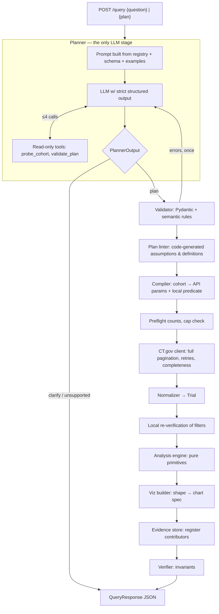

# ctgov-viz — Implementation Plan

Natural-language question about clinical trials → validated query plan → complete retrieval from
ClinicalTrials.gov API v2 → deterministic analysis → verified, frontend-ready visualization JSON
with NCT-level and field-level evidence.

**Guiding rule:** the LLM only *interprets* the question into a constrained plan. Validated code
retrieves records, computes every number, chooses encodings, and verifies the response. No count,
NCT ID, label, or chart value in a response can originate from the model.

---

> **Status (2026-09-23): milestones M0–M7 are implemented; see README.md for the current
> system. The one open item is running the golden planner set against a live LLM (needs an
> `OPENAI_API_KEY`). The optional demo UI from M8 was not built. The snapshot below is the
> starting point this plan was written from.**

## 0. Starting state (snapshot, 2026-09-23)

### Already implemented (≈1,800 lines, imports cleanly, no tests yet, no commits yet)

| Module | Status | Notes |
|---|---|---|
| `app/settings.py` | done | env-driven config (CT.gov, LLM, evidence, cache) |
| `app/contracts/plan.py` | done | `QueryPlan` = cohorts[] + one `Analysis` (aggregate / cooccurrence / numeric_pair) |
| `app/contracts/trial.py` | done | canonical `Trial`, `Intervention`, `DateValue` (frozen dataclasses) |
| `app/contracts/analysis.py` | done | `AnalysisResult` with `Row`/`Node`/`Edge`/`Point`; counts are `len(contributors)` |
| `app/contracts/viz.py` | done | `VisualizationSpec` v1.0, `EvidenceRef`, encodings, network, geo hint |
| `app/contracts/response.py` | done | `QueryRequest`, `QueryResponse`, `Meta`, `Clarification`, `EvidencePage` |
| `app/registry/fields.py` | done | field registry: dimensions, legal ops, extractors, source paths, ordering |
| `app/registry/validator.py` | done | semantic plan rules → list of messages (repair-friendly) |
| `app/ctgov/client.py` | done | async client: full pagination, retries/backoff, Retry-After, completeness |
| `app/ctgov/compiler.py` | done | cohort → API params + local re-verification predicate |
| `app/normalize/*` | done | study JSON → `Trial`; dates, countries (ISO3), interventions, labels |
| `app/analysis/ops.py`, `engine.py` | done | reusable primitives + the three analysis kinds |
| `app/planner/` | **empty** | LLM planner, tools, prompt, fake planner |
| `app/viz/` | **empty** | `AnalysisResult` → `VisualizationSpec` |
| `app/evidence/` | **empty** | evidence store + paginated evidence |
| `app/verify/` | **empty** | response invariants |
| `app/api/` | **empty** | FastAPI app, routes, error mapping |
| `app/pipeline.py` | **missing** | orchestration |
| `tests/**`, `scripts/`, `examples/`, `demo/`, `README.md` | **empty** | |

### API facts verified live (API v2.0.5, dataTimestamp 2026-09-23T09:00:05)

- `GET /api/v2/studies` with `query.cond`, `query.intr`, `query.term`, `query.spons`, `query.locn`,
  `filter.overallStatus`, `filter.advanced`, `fields`, `pageSize`, `pageToken`, `countTotal` all
  behave as the compiler assumes.
- `filter.advanced` syntax works: `AREA[Phase]PHASE3`, `AREA[Phase](PHASE2 OR PHASE3)`,
  `AREA[StartDate]RANGE[2015-01-01,MAX]`, combined with `AND`.
- `pageSize` is silently capped at **1000**; pagination is a **sequential cursor**
  (`nextPageToken`), so pages of one cohort cannot be fetched in parallel.
- `totalCount` is only returned when `countTotal=true` (first page).
- Invalid queries return **HTTP 400 with a plain-text message** (not JSON) → must not be retried.
- Arm groups reference interventions as `"Drug: Pembrolizumab (KEYTRUDA®)"`; intervention list
  has `{"type": "DRUG", "name": "Pembrolizumab (KEYTRUDA®)"}` — the normalizer's key matching
  between the two is correct.
- Locations repeat countries per site (e.g. 7× "United States" in one study) → per-study dedupe
  is essential and already done.
- Cohort sizes: breast cancer 16,843 · lung cancer 14,566 · melanoma 3,764 · pembrolizumab 2,957
  · nivolumab 2,024 · "cancer" 123,526 (exceeds the 20k safety cap).
- One 1000-study page with all fields ≈ 1.2 MB / 1.2 s; with only `NCTId,StartDate` ≈ 125 KB.
  → Worst in-cap case (~17–20 pages) ≈ 20–25 s cold. Field projection + caching matter.

---

## 1. Goals mapped to the evaluation rubric

| Rubric area (weight) | What earns it in this project | Where |
|---|---|---|
| System design (35%) | Strict one-way pipeline with typed contracts between stages; field registry as the single extension point; honest completeness; real-world data handling (partial dates, repeated sites, multi-phase, missing modules, API failures) | §2, §3, §5 |
| AI / agent design (20%) | LLM confined to plan generation; strict JSON schema output; read-only bounded tools for grounding; validator + one repair loop; clarification path; code-generated assumptions; golden-set evaluation | §5.1 |
| Code quality (20%) | Pure engine, small modules, strict mypy on contracts/analysis, ruff, unit/integration/live tests, docstrings stating contracts | §9 |
| Query & viz coverage (15%) | 3 analysis kinds × 9 dimensions × cohorts cover all appendix classes with **zero intent-specific code**; bar, grouped bar, line, multi-line, choropleth-ready bar, network (co-occurrence *and* bipartite), scatter | §7 |
| I/O design (10%) | Versioned request/response schemas, discriminated status, pre-aggregated ordered data, explicit encodings + sort arrays, optional embedded Vega-Lite, `GET /schema` | §4, §5.6 |
| Bonus: traceability | Every data row / node / edge carries `EvidenceRef` (total, sample, paginated ref); evidence items include the exact source field values that justified membership; reproducible API URLs | §5.7 |

---

## 2. Architecture



### Component boundaries and dependency rule

`contracts` depends on nothing. Everything else depends on `contracts` and flows one way:
`planner → registry/validator → ctgov → normalize → analysis → viz → evidence → verify`.
Only `planner` (LLM) and `ctgov` (HTTP) do I/O. `analysis`, `viz`, `verify` are pure functions
and unit-testable with hand-built `Trial`s.

| Component | Input → Output | Owns | Must never |
|---|---|---|---|
| Planner | question → `PlannerOutput` (plan \| clarification \| unsupported) | prompt, tools, repair | emit counts, NCT IDs, chart data |
| Validator | `QueryPlan` → `list[str]` errors | legality of field/op combos, limits | touch the network |
| Plan linter | `QueryPlan` → assumptions/definitions | disclosures that must be reliable | depend on LLM wording |
| Compiler | `Cohort` → `CTGovQuery` (params + predicate) | API syntax, escaping, pushdown | decide semantics the plan did not state |
| Client | params → `FetchResult` (raw studies, total, pages, complete, reason) | pagination, retry, timeouts, error mapping | report complete after a failed page |
| Normalizer | raw study → `Trial` | nesting, missing values, canonical labels, source map | impute values; fuzzy-merge names |
| Engine | plan + cohort trials → `AnalysisResult` | filtering, grouping, distinct counts, ordering, pairs | know about HTTP, LLM, or chart types |
| Viz builder | `AnalysisResult` → `VisualizationSpec` | chart type, encodings, labels, Vega-Lite | recompute or alter counts |
| Evidence store | contributors → refs + pages | query_id, item ids, pagination | outlive its LRU silently (ref says so) |
| Verifier | response + analysis + fetched ids → ok \| violations | invariants | "fix" data; it only rejects |
| API | HTTP ↔ pipeline | status codes, schemas, CORS | contain business logic |

---

## 3. Key design decisions (with rationale)

**D1 — Plan = cohorts + one analysis, not intents.** A comparison is ≥2 cohorts with
`series_by="cohort"`; a trend is `aggregate` with a `time` axis; a geography question is
`aggregate` on `country`. Three analysis kinds cover every appendix query. Adding a dimension is
one `FieldDef` + test; the engine is untouched. This is the answer to "no one-off hacks".

**D2 — LLM output is a constrained schema, never free text.** Enums for phase/status/study type/
dimensions, bounded lists, `extra="forbid"`. The schema has no field where a number or NCT ID
could be placed. Semantic rules the schema can't express live in the validator and are returned
as a message list so a single repair turn can fix them all.

**D3 — Free-text matching is delegated to CT.gov; structured filters are pushed down *and*
re-verified locally.** CT.gov's `query.cond` / `query.intr` expand synonyms (Keytruda, MK-3475 →
pembrolizumab), which is better than anything we'd hand-roll. Status/phase/date/study type/country
are pushed to the API to shrink downloads, then re-checked on each normalized `Trial`, so every
cited study provably satisfies the plan's structured filters. Studies failing the local check are
counted in `meta.excluded.failed_local_filter` (expected ~0; nonzero signals API/semantics drift).

**D4 — Distinct NCT IDs are the unit, enforced structurally.** `Row.count` is
`len(contributors)` where contributors is a dict keyed by NCT ID. Counts and evidence cannot
drift apart; double counting a study within a group is impossible by construction.

**D5 — Phase is one bucket per study.** `[PHASE2, PHASE3]` → "Phase 2/3" (CT.gov's own display
convention). Bars sum to studies analyzed, which is the most honest phase distribution. The
alternative "explode" semantics (a Phase 2/3 study counted in both Phase 2 and Phase 3) is noted
as a possible `phase_mode` extension, not implemented by default. *Filter* semantics differ and
are disclosed: filtering "Phase 3" matches any study whose phase list contains PHASE3 (so Phase
2/3 studies are included).

**D6 — Completeness is explicit, never implied.** Preflight `totalCount` per cohort; cohorts above
`max_studies_per_cohort` (20k) are **refused with a narrowing suggestion** (`needs_clarification`)
rather than analyzed on a biased first-N sample. A page failing after retries mid-run yields
`status="partial"` with `meta.completeness.reason`. Page-1 failure → error. `dataTimestamp` is read
before and after retrieval; if it changes mid-fetch, a warning is added.

**D7 — Evidence is complete, paginated, and field-level.** Each row/node/edge ships
`EvidenceRef{total, sample (≤5 NCT IDs), ref}`; `GET /query/{id}/evidence/{item}` returns every
contributor with its study URL, title, and the exact source values (API field path → raw value)
that placed it in that group. `query_id` is deterministic (hash of canonical plan + CT.gov
`dataTimestamp`), and `meta.api_queries[].url` gives reproducible API calls even after the
in-memory store evicts.

**D8 — Assumptions/definitions that matter are generated by code.** The LLM may add plain-English
assumptions about ambiguous wording, but the reliable disclosures (e.g. "Phase 3 filter includes
Phase 2/3 studies", "start year ≠ active during year", "studies in both cohorts count in both
series", "co-occurrence ≠ same arm") are emitted by the plan linter/engine from the plan itself.

**D9 — Ambiguity policy: default + disclose; clarify only when materially different.** If a
conventional default exists (e.g. "trials in 2020" → start date in 2020; "recruiting" →
`RECRUITING` only), use it and record the assumption. Ask for clarification only when
interpretations would produce materially different charts with no sensible default (e.g. "show
trends for immunotherapy" — which dimension/time field?). Clarification options are complete
`QueryPlan`s so the frontend re-submits `{plan}` and skips the LLM.

**D10 — Deterministic ordering everywhere.** Years ascending and zero-filled; phases/status/
sponsor class by domain order; ranked categories by count desc, tie-break label then key;
networks by weight desc then ids; scatter points by NCT ID. Same plan + same data → byte-identical
data arrays.

**D11 — Chart type is chosen by code from the analysis shape**, not by the LLM:
`category→bar`, `category_series→grouped_bar`, `temporal→line`, `temporal_series→multi-line`,
`geo→choropleth_bar` (bar + ISO3 geo hint so a frontend can draw a map), `network→network`,
`scatter→scatter`.

**D12 — The verifier rejects, it doesn't repair.** A violated invariant is a bug; the response is
replaced by a 500 `verification_failed` error listing violations. Shipping a wrong chart is worse
than shipping none.

**D13 — Provider isolation.** The planner talks to an `LLMClient` protocol; `OpenAIClient`
(already configured: `openai_model=gpt-5-mini`) and `FakeLLM` (scripted, for tests/offline demo)
implement it. Swapping providers is one adapter.

**D14 — Plain Python, no pandas, no agent framework.** Contributor sets and provenance are clearer
as dicts; the bounded tool loop is ~60 lines and doesn't need a framework.

---

## 4. Contracts (existing — changes listed)

### 4.1 Request
```json
{ "question": "Which countries have the most recruiting Phase 3 lung cancer trials?" }
// or, e.g. after a clarification:
{ "plan": { ...QueryPlan... } }
```

### 4.2 QueryPlan (the LLM's only product) — example for the geography demo
```json
{
  "version": "1",
  "cohorts": [{
    "label": "Lung cancer",
    "condition": "lung cancer",
    "filters": { "overall_status": ["RECRUITING"], "phase": ["PHASE3"] }
  }],
  "analysis": { "kind": "aggregate", "dimension": "country", "top_k": 20,
                "sort": { "by": "count_desc" } },
  "assumptions": ["'Recruiting' interpreted as overall status RECRUITING."]
}
```

### 4.3 Response (shape; numbers/IDs below are illustrative placeholders, not real results)
```json
{
  "status": "ok",
  "query_id": "q_3f9a1c2b7d10",
  "question": "...",
  "plan": { "...": "echoed validated plan" },
  "visualization": {
    "schema_version": "1.0",
    "type": "choropleth_bar",
    "title": "Recruiting Phase 3 lung cancer studies by country",
    "subtitle": "Top 20 of N countries · distinct studies (NCT IDs)",
    "encoding": {
      "x": { "field": "country", "type": "nominal", "title": "Country", "sort": ["United States", "China", "..."] },
      "y": { "field": "study_count", "type": "quantitative", "title": "Studies" }
    },
    "data": [
      { "country": "United States", "iso3": "USA", "study_count": 0,
        "evidence": { "total": 0, "sample": ["NCT_EXAMPLE"], "ref": "/query/q_3f9a1c2b7d10/evidence/r0" } }
    ],
    "geo": { "iso3_field": "iso3", "name_field": "country", "value_field": "study_count" },
    "vega_lite": { "...": "optional ready-to-render spec of the same data" }
  },
  "meta": {
    "source": "ClinicalTrials.gov API v2", "api_version": "2.0.5",
    "data_timestamp": "...", "retrieved_at": "...",
    "unit": "distinct studies (NCT IDs)",
    "definitions": { "country": "Distinct site countries per study; ...", "multi_valued": "..." },
    "api_queries": [{ "cohort": "Lung cancer", "url": "https://clinicaltrials.gov/api/v2/studies?...",
                      "total": 0, "fetched": 0, "pages": 1, "complete": true }],
    "completeness": { "complete": true, "reason": null },
    "studies_analyzed": 0, "cohort_overlap": {}, "excluded": { "no_country_reported": 0 },
    "assumptions": ["..."], "warnings": ["Showing the top 20 of N country values by study count."],
    "llm": { "model": "gpt-5-mini", "tool_calls": ["probe_cohort"], "repaired": false }
  }
}
```

Network charts populate `nodes[]` (`id, label, group, study_count, evidence`) and
`edges[]` (`source, target, weight, evidence`) instead of `data`.

### 4.4 Contract changes to make
1. `EvidenceRef`: add `complete_inline: bool` (true when `total ≤ sample size`, so the sample *is*
   the full list and no follow-up call is needed).
2. `Status`: keep `ok | partial | empty | needs_clarification | unsupported | error`.
3. New `app/planner/schema.py::PlannerOutput` — discriminated union
   `{"type":"plan", plan} | {"type":"clarify", question, options[{label, description, plan}]} |
   {"type":"unsupported", reason, closest_supported?}`. Must be accepted by OpenAI strict
   structured outputs (all properties required, optionals as `nullable`, no non-null defaults) —
   so it is a **separate LLM-facing draft model converted into `QueryPlan`**, keeping the internal
   contract free to use defaults. Unit test asserts the strict-schema conversion succeeds.
4. `Meta`: add `timings_ms: dict[str, int]` (plan/fetch/analyze/verify) for observability.
5. Publish JSON Schemas via `GET /schema` (`QueryRequest`, `QueryPlan`, `QueryResponse`,
   `EvidencePage`) and `GET /capabilities` (registry: dimensions, titles, legal ops, measures).

---

## 5. Component specifications

### 5.1 Planner (`app/planner/`) — AI/agent design

Files: `llm.py` (protocol + OpenAI + Fake), `prompt.py`, `tools.py`, `schema.py`, `planner.py`.

**Prompt (built at startup from code, never hand-maintained):**
- Role + guiding rule ("produce a plan; you cannot compute or cite data").
- Capabilities rendered from `REGISTRY` (dimension, title, allowed ops, description) and
  `Measure` — so the prompt and the validator can never disagree.
- Semantics & defaults table (D9): recruiting, "since YEAR", "trials in YEAR", "vs"/"compare",
  "combination" → `scope="arm"`, "drug network" → `drugs_only`, "most common/top" → `count_desc`.
- Field-choice guidance: disease → `condition`; drug/device/procedure → `intervention`;
  company/institution → `sponsor`; `term` only as last resort.
- 6–8 few-shot question → plan examples (the five demos + two appendix variants + one clarify +
  one unsupported).

**Tools (read-only, bounded to `planner_max_tool_calls=4`):**
| Tool | Returns | Purpose |
|---|---|---|
| `probe_cohort(cohort)` | `{total, sample_titles[3], api_url}` via `client.count`/`client.sample` | Ground search terms: detect 0 hits (typo / wrong field), detect > cap (needs narrowing), sanity-check meaning ("MS" → multiple sclerosis?) |
| `validate_plan(plan)` | validator messages | Lets the model self-check before finalizing |

Tool results inform *the plan only*; nothing from a tool result is copied into the response data.

**Loop:**
1. Call LLM with tools + strict `PlannerOutput` schema.
2. Execute tool calls (budget enforced; exceeding → force final answer).
3. Parse → Pydantic → `validate_plan`. On errors: one repair turn with the full error list.
   Still invalid → `status="error", code="plan_invalid"` with messages (never guess).
4. Record `meta.llm = {model, tool_calls, repaired}`.

**Hallucination controls summary:** no data fields in schema · enums for all categorical filters ·
registry-derived prompt · validator + single repair · probe-based term grounding · code-generated
disclosures (D8) · response verifier checks every NCT ID was actually fetched.

**Fake planner:** `FakeLLM` returns scripted outputs keyed by normalized question; used in unit/
integration tests and enables `LLM_MODE=fake` offline demos for the five demo questions.

### 5.2 Validator + plan linter (`app/registry/`)
- Validator exists. Add rules: `country` filter string non-empty and resolvable by
  `canonical_country` (warn if no ISO3); `top_k` default applied by engine is disclosed; cohort
  search strings ≤ 200 chars, stripped.
- New `linter.py::disclosures(plan) -> (assumptions, definitions)`:
  phase-filter inclusion rule, status meaning, start-date semantics, cohort overlap semantics,
  network scope semantics, enrollment actual-vs-estimated, date range inclusivity.

### 5.3 Compiler + client (`app/ctgov/`)
Existing; changes:
- **Push time bounds down:** fold `analysis.time.from_year/to_year` into
  `AREA[StartDate]RANGE[YYYY-01-01,YYYY-12-31]` to avoid downloading out-of-range studies.
- **Field projection:** `FieldDef.api_fields`; compiler requests the union of fields needed by
  the plan's dimensions/filters/measures + always `NCTId, BriefTitle` (~10× smaller pages for
  trend questions). Normalizer already tolerates absent fields.
- **Preflight:** `count()` all cohorts concurrently (bounded by `ctgov_concurrency`), refuse
  > cap (D6), short-circuit `empty` when all totals are 0 (with the API URLs in meta).
- Wrap `resp.json()` decode errors as `CTGovError` (currently an uncaught `ValueError`).
- Overall request deadline (`request_deadline_s`, default 90 s) via `asyncio.timeout`; on expiry
  → 504 `upstream_timeout` (don't return a silently truncated chart).
- Parameter values are passed via httpx `params` (URL-encoded); reject control characters and
  strip `AREA[`/`RANGE[` tokens from free-text search fields so user text cannot inject advanced
  filter syntax.

### 5.4 Normalizer (`app/normalize/`)
Existing; changes:
- Network node group label: use `INTERVENTION_TYPE_LABELS` instead of `.title()`
  (`DIETARY_SUPPLEMENT` currently renders as "Dietary_Supplement").
- Record per-query normalization failures in `meta.excluded.invalid_record`.
- Keep `source` map as the field-level evidence; ensure every `FieldDef.source_paths` entry is
  populated (test).

### 5.5 Engine (`app/analysis/`)
Existing, covers all analysis kinds. Changes/checks:
- Excluded counts in comparisons: count per (cohort, study) and label as such.
- Compute `cohort_overlap` (pairwise |A∩B| by NCT ID) in the pipeline for multi-cohort plans.
- Scatter: `enrollment == 0` currently excluded (`if t.enrollment`) — keep but disclose
  ("0-enrollment studies, typically withdrawn, excluded; log scale").
- Operation sequences (for README):

| Result | Sequence |
|---|---|
| Phase bars | filter → phase bucket per study → group → distinct count → domain order |
| Yearly trend | filter → start year → range + zero-fill → distinct count → chronological |
| Country ranking | filter → distinct canonical countries per study → group → distinct count → count desc → top-k |
| Drug comparison | per-cohort retrieval → tag cohort → group (cohort, phase) → distinct count → aligned series |
| Co-occurrence network | eligible deduped interventions per study (or per arm) → unordered pairs → group → distinct count → top edges |
| Bipartite network | sponsor × eligible interventions per study → pairs → group → distinct count |
| Scatter | two measures per study → drop missing → sort by NCT → cap points |

### 5.6 Viz builder (`app/viz/builder.py`)
- Pure mapping `AnalysisResult → VisualizationSpec` per D11.
- Data rows: dimension fields + `study_count` + `evidence` (+ `iso3` for geo, + series field).
- `encoding.x.sort` = explicit category order; `encoding.color.sort` = series order.
- Titles/subtitles generated from plan (cohort labels, filters, time range) — deterministic
  templates, not LLM text.
- Hints: bar `orientation="horizontal"` when category labels are long/ranked; scatter
  `scale="log"` for enrollment; network `layout="force"`, `node_size_field="study_count"`,
  `edge_weight_field="weight"`, `group_field="group"`.
- `vega_lite` embedded for bar/grouped bar/line/scatter (Vega-Lite v5, `data.values` = same rows).
  Networks: nodes/edges only (Vega-Lite has no network mark).

### 5.7 Evidence store (`app/evidence/store.py`)
- In-memory LRU (`response_cache_size=128`) keyed by `query_id` →
  `{item_id: sorted list[Contributor]}` plus trial titles.
- Item ids: `r{i}` rows, `n{i}` nodes, `e{i}` edges, `p` all scatter points.
- `GET /query/{query_id}/evidence/{item_id}?page=1&page_size=100` → `EvidencePage` with
  `{nct_id, url, title, fields_used}`; 404 with "expired — re-run plan" when evicted.
- The same LRU caches full responses by `query_id` (identical plan + same `dataTimestamp` → cache hit).

### 5.8 Verifier (`app/verify/checks.py`)
Checks (each a small function returning violations):
1. Every row/node/edge: `study_count == evidence.total == len(store contributors)`; counts ≥ 0.
2. Every NCT ID in samples/store matches `^NCT\d{8}$` **and** is in the fetched set.
3. Every contributor satisfies the cohort predicate (re-run predicate on the trial).
4. Ordering: data order equals `encoding.x.sort` × series order; years contiguous ascending.
5. Series alignment: every series has every category (explicit zeros).
6. Network: edge endpoints exist in nodes; `weight ≤ min(endpoint study_count)`; no self-loops;
   no duplicate unordered pairs.
7. Single-valued dimension without top-k: `Σ counts + excluded == studies analyzed` per series.
8. `completeness.complete == all(api_queries[].complete)`; `status == "partial"` iff incomplete.
9. Payload bounds: rows ≤ 500, edges ≤ 150, points ≤ 5000, serialized size ≤ 3 MB.
10. `status == "empty"` iff no nonzero datum; empty responses carry a `message`.

### 5.9 Pipeline (`app/pipeline.py`) and API (`app/api/`)
Pipeline steps (timed into `meta.timings_ms`): plan → validate → lint → compile → preflight →
fetch (concurrent cohorts) → normalize → local re-verify → engine → overlap → viz → evidence →
verify → response (+ cache).

Routes:
| Route | Purpose |
|---|---|
| `POST /query` | main entry (`question` or `plan`) |
| `GET /query/{id}/evidence/{item}` | paginated contributors with field values |
| `GET /capabilities` | registry-derived supported dimensions/ops/measures |
| `GET /schema` | JSON Schemas of request/plan/response |
| `GET /health` | liveness + CT.gov `/version` reachability |

Status/HTTP mapping:
| Situation | HTTP | body.status / code |
|---|---|---|
| Chart produced | 200 | `ok` |
| Chart with failed later page | 200 | `partial` + reason |
| Valid plan, zero matches | 200 | `empty` + message + API URLs |
| Ambiguous / cohort too broad | 200 | `needs_clarification` + options |
| Outside capabilities | 200 | `unsupported` + closest supported |
| Malformed request / invalid supplied plan | 422 | `error` / `invalid_request`, `plan_invalid` |
| LLM could not produce a valid plan | 422 | `error` / `plan_invalid` |
| CT.gov 4xx on our query | 502 | `error` / `upstream_rejected` |
| CT.gov unavailable after retries (page 1) | 502 | `error` / `upstream_unavailable` |
| Deadline exceeded | 504 | `error` / `upstream_timeout` |
| LLM unavailable | 503 | `error` / `llm_unavailable` |
| Verifier violation | 500 | `error` / `verification_failed` |

---

## 6. Semantics & definitions (single source for README and `meta.definitions`)

| Topic | Rule |
|---|---|
| Unit | Distinct NCT IDs. Never sites, arms, or conditions. |
| Phase grouping | One bucket per study; multi-phase → "Phase 1/2", "Phase 2/3"; none → "Not Reported". |
| Phase filter | Matches studies whose phase list *contains* the phase (Phase 3 includes Phase 2/3). |
| "Recruiting" | `overallStatus = RECRUITING` only (not "not yet recruiting" / "by invitation"). |
| Year of a trial | Start-date year (actual or anticipated). Not "active during year". Future start years are flagged; current year flagged as partial. |
| "Since 2015" | Start year ≥ 2015 through the latest observed year, zero-filled. |
| Country | Distinct canonical site countries per study; multinational study counts once per country; sums may exceed study total. |
| Comparison | Independent cohorts; a study matching both contributes to both series; overlap reported. |
| Co-occurrence (study) | Both interventions listed in the same study — not proof of combined administration. |
| Co-occurrence (arm) | Both assigned to the same arm group — "given together". Used for "combination" wording. |
| Placebo | Placebo/sham/vehicle/SOC excluded from networks by default (disclosed). |
| Intervention identity | Deterministic normalization only (case, ™/®, trailing dose, trailing parenthetical); no fuzzy merges; raw names kept in evidence. |
| Duration | Start → primary completion, months; requires month precision on both; negative excluded. |
| Enrollment | Registered count (actual or estimated per `enrollmentInfo.type`). |
| Condition matching | As matched by CT.gov condition search (includes its synonym expansion). |

---

## 7. Query coverage matrix (all via the same three analysis kinds)

| Question class | Example | Plan essentials | Chart |
|---|---|---|---|
| Trend (condition) | Breast cancer trials started each year since 2015 | 1 cohort cond; aggregate, `time{from_year:2015}` | line |
| Trend (drug) | How has the number of pembrolizumab trials changed per year since 2015? | cohort intr; time | line |
| Trend comparison | Pembrolizumab vs nivolumab trials per year | 2 cohorts; time; `series_by=cohort` | multi-line |
| Distribution | Pembrolizumab trials by phase | cohort intr; `dimension=phase` | bar |
| Distribution | Most common intervention types for melanoma trials | cohort cond; `dimension=intervention_type`, count_desc | bar |
| Distribution | Melanoma trials by status / sponsor class / study type | same, other dimension | bar |
| Top-k | Top sponsors of Alzheimer's trials | `dimension=sponsor`, top_k | horizontal bar |
| Comparison | Pembrolizumab vs nivolumab by phase | 2 cohorts; phase; `series_by=cohort` | grouped bar |
| Comparison | Sponsor classes: breast vs lung cancer | 2 cohorts; `sponsor_class`; series cohort | grouped bar |
| Cross-tab | Lung cancer trials by phase and sponsor class | 1 cohort; phase; `series_by=sponsor_class` | grouped/stacked bar |
| Geography | Countries with most recruiting Phase 3 lung cancer trials | filters status+phase; `country`, top_k | choropleth_bar |
| Geography filter | Phase distribution of diabetes trials in India | `filters.country="India"`; phase | bar |
| Network | Interventions co-occurring in melanoma studies | cooccurrence intervention×intervention, scope study | network |
| Network | Drugs in combination studies (drug↔drug) | scope arm, drugs_only | network |
| Bipartite | Sponsors ↔ drugs for NSCLC trials | cooccurrence sponsor×intervention | bipartite network |
| Numeric | Enrollment vs duration for Phase 3 breast cancer | numeric_pair enrollment × duration_months | scatter |
| Clarify | "Show immunotherapy trends" | → `needs_clarification` with 2–3 plan options | — |
| Unsupported | "Which trials had the best survival outcomes?" | → `unsupported` (results/outcomes not in registry) | — |
| Too broad | "Cancer trials by country" (123k) | → `needs_clarification` suggesting status/phase/date narrowing | — |

---

## 8. Fixes to existing code (do first, each with a test)

1. `client._get`: wrap JSON decode errors → `CTGovError`.
2. Engine network node groups: use `INTERVENTION_TYPE_LABELS`.
3. Push `analysis.time` bounds into the API query (compiler receives the analysis).
4. Excluded counts in multi-cohort aggregates labeled per cohort.
5. Free-text sanitization in compiler (strip `AREA[`, `RANGE[`, control chars).
6. `fetch_all` cap branch becomes unreachable in normal flow once preflight exists; keep as a
   defensive guard.
7. `pyproject.toml` references `README.md` which doesn't exist yet (breaks `uv build`).

---

## 9. Testing & verification strategy

**Unit (`tests/unit/`, no network):**
- `ops`: `unordered_pairs` dedupe/ordering, `bipartite_pairs`, `arm_pairs`, `order_categories`
  tie-breaking & domain order, `year_range`.
- Normalizer on **recorded real records** (`tests/fixtures/*.json`): missing modules, multi-phase,
  repeated site countries, partial dates (`"2019"`, `"2019-05"`), arm prefixes, ™/® names,
  placebo detection, invalid NCT.
- Countries: overrides, pycountry fallback, unknown kept verbatim.
- Compiler: params for each filter, OR-phase syntax, date RANGE, sanitization; predicate truth table.
- Validator: one test per rule; registry ↔ prompt consistency test.
- Engine with hand-built trials and hand-computed answers for every §7 row, specifically:
  country dedupe (3 US sites → 1), multinational counted per country, multi-phase single bucket,
  comparison overlap (study in both cohorts in both series), intervention pair dedupe (same drug
  listed twice → no self-pair), arm vs study scope difference, zero-filled years, top-k ties.
- **Property tests (hypothesis):** random trials → `count == len(set(contributors))`; single-valued
  sums invariant; edge weight ≤ min node count; output order deterministic under input shuffle.
- Viz builder: each shape → correct chart type/encodings/sort; Vega-Lite spec validity smoke check.
- Verifier: inject each violation type → caught.
- Planner with `FakeLLM`: tool budget enforced, repair loop (invalid → valid), repair failure →
  `plan_invalid`, clarify passthrough, unsupported passthrough, strict-schema conversion succeeds.

**Integration (`tests/integration/`, respx-mocked CT.gov):**
- Pagination across 3 pages; duplicate NCT across pages deduped; `totalCount` mismatch → partial.
- 503 then success (retried); 429 + Retry-After honored; 400 not retried → 502 `upstream_rejected`.
- Page-2 failure after retries → `status=partial` with reason; page-1 failure → 502.
- Preflight > cap → `needs_clarification`; zero total → `empty`.
- Full `POST /query` for each demo with fake planner + recorded fixtures → verifier passes,
  evidence endpoint pages correctly, cached second call returns same `query_id`.

**Golden planner set (`tests/golden/questions.yaml`, ~25 cases):** paraphrases of each demo, all
appendix types, ambiguous ("trials in 2020"), clarify-worthy, unsupported, typo'd drug names,
too-broad. Each case asserts *properties* (kind, dimension, series_by, cohort fields, filters,
output type) rather than exact JSON. Runs against FakeLLM always; against the real model with
`pytest -m live`; accuracy table recorded in README.

**Live end-to-end (`tests/live/`, `-m live`):** five demo questions against real CT.gov with
**independent oracle checks** using API counts, e.g.:
- phase distribution: Σ bars + excluded == cohort `totalCount`;
  "Phase 3" bar == count(`AREA[Phase]PHASE3 AND NOT AREA[Phase](PHASE2 OR PHASE4)`)-style query;
- yearly trend: each year's bar == count with `AREA[StartDate]RANGE[Y-01-01,Y-12-31]`;
- evidence: 5 random NCT IDs fetched from `/studies/{id}` contain the cited field values.

---

## 10. Milestones (in order, each with acceptance criteria)

| # | Milestone | Done when |
|---|---|---|
| M0 | Repo hygiene | first commit; `README.md` stub; `ruff` + `mypy` clean on existing code; `scripts/capture_fixtures.py` records ~15 real studies covering edge cases into `tests/fixtures/` |
| M1 | Fixes §8 + unit tests for existing modules | normalizer/compiler/validator/ops/engine unit tests green, incl. property tests |
| M2 | Viz builder | every `AnalysisResult` shape maps to a valid `VisualizationSpec`; tests green |
| M3 | Evidence store + verifier | all §5.8 checks implemented and each proven by an injected-violation test |
| M4 | Pipeline + API with hand-written plans (`{plan}` input, no LLM) | five demo plans run end-to-end against live CT.gov and pass the verifier; integration tests with respx green |
| M5 | Planner (OpenAI + Fake), tools, repair, clarify/unsupported | golden set passes on FakeLLM; ≥ 90 % property accuracy on live model; results in README |
| M6 | Performance | field projection + time pushdown + response cache; breast-cancer trend cold < 15 s, warm < 50 ms |
| M7 | Live oracle tests + examples | `examples/*.json` = real responses for the 5 demos (+2 appendix: bipartite, scatter) generated by `scripts/run_examples.py`; live tests green |
| M8 | Docs + optional demo UI | README complete (§11); optional `demo/index.html` rendering `vega_lite` specs + a force-directed network from the API |

---

## 11. Documentation deliverables (README.md)

Setup (`uv sync`, `.env` with `OPENAI_API_KEY`, `LLM_MODE=fake` for offline), run
(`uv run uvicorn app.api.main:app`), curl examples, architecture diagram + component table,
contracts with a real example response, semantics table (§6), coverage matrix (§7), AI design &
hallucination controls, testing (how to run unit/integration/live, golden accuracy table),
design decisions (§3, condensed), limitations (§12), reproducibility (query_id, API URLs,
dataTimestamp).

---

## 12. Out of scope / known limitations

- Results/outcome data (efficacy, adverse events) — `unsupported`.
- "Active during year" timelines (needs start–completion interval logic) — possible extension.
- Cohorts > 20k studies are refused, not sampled.
- Intervention synonyms beyond CT.gov's search expansion are not merged in grouping
  (e.g. "MK-3475" and "Pembrolizumab" registered as separate names stay separate nodes).
- Evidence store is in-memory; evidence refs expire on restart/eviction (plan + API URLs remain
  for reproduction).
- Condition grouping uses registered condition strings (no MeSH rollup).
- Frontend rendering is outside the backend contract (optional demo page only).

---

## 13. Open decisions (defaults chosen; override if desired)

1. **LLM provider:** OpenAI `gpt-5-mini` (already in `pyproject`/settings), behind `LLMClient`.
2. **Phase semantics:** single combined bucket per study (D5); explode mode not built.
3. **Over-cap cohorts:** refuse with narrowing suggestion (D6) rather than partial sample.
4. **Demo frontend:** optional, built last (M8).
