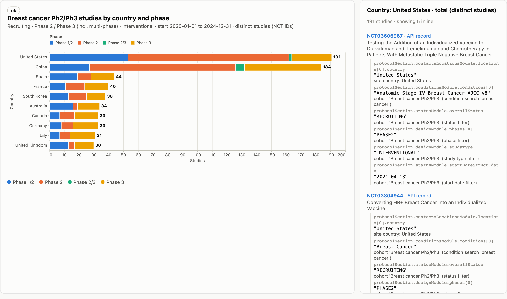
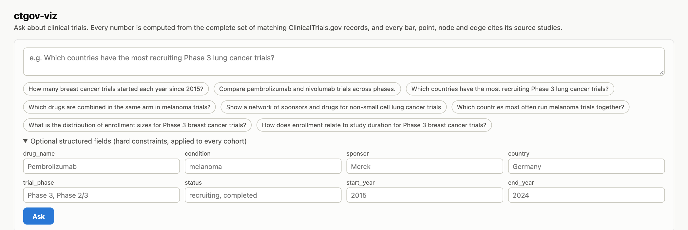
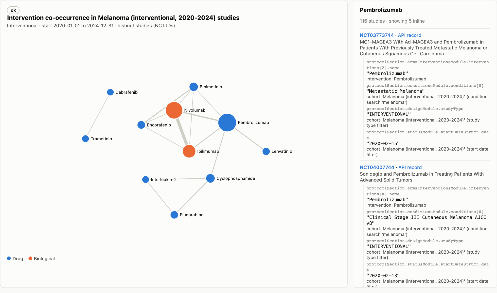
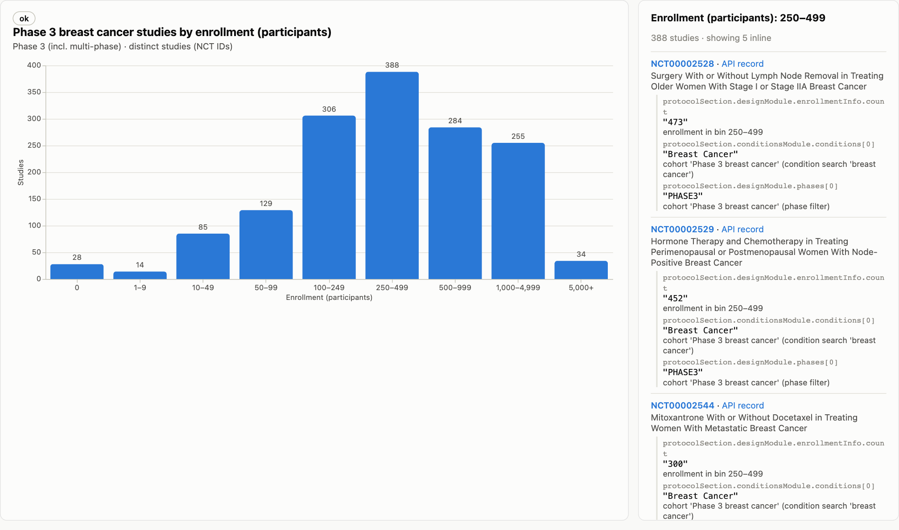
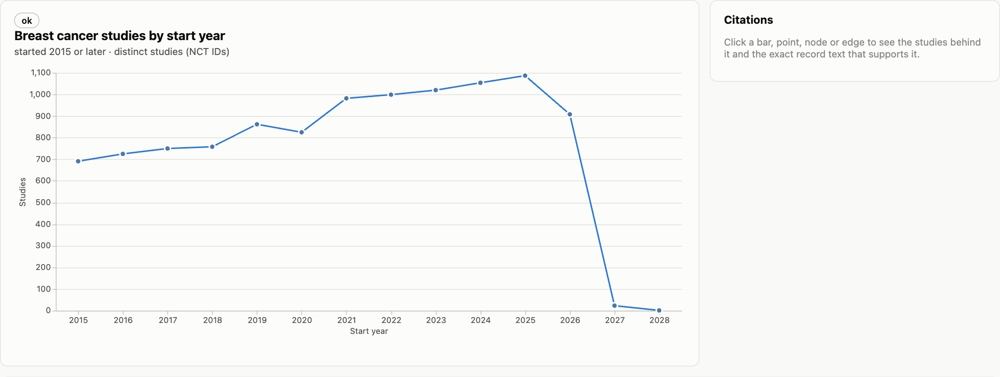
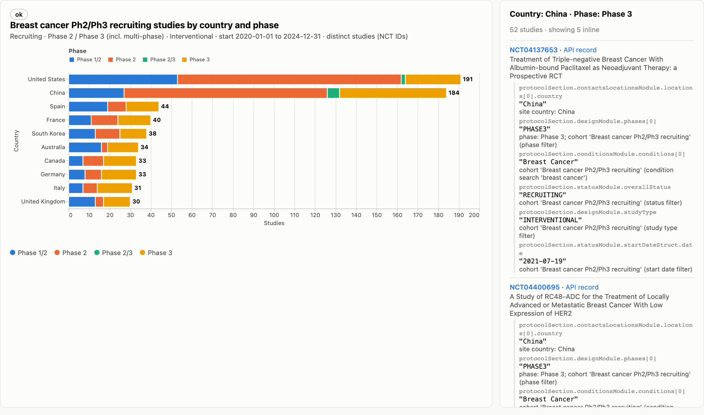
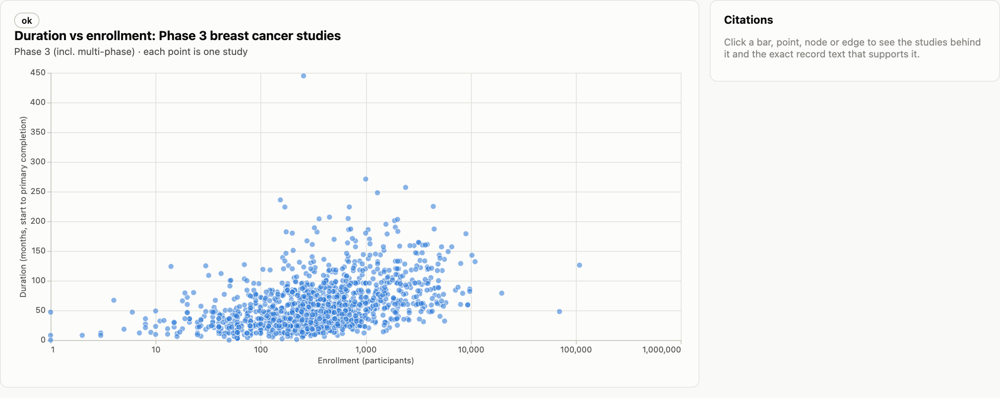

# ctgov-viz

Ask a question about clinical trials in plain English and get back a chart built from ClinicalTrials.gov data. You can click a bar, point, or network connection to see which studies contributed to it.



*"For interventional breast cancer studies that started from 2020 through 2024 and are currently recruiting, which 10 countries have the most Phase 2 and Phase 3 trials? Show the counts by phase for each country."*

The app finds matching studies, counts distinct trials, and returns both the chart and the data behind it. Claude interprets the question; the actual counts, chart data, and citations come from code and ClinicalTrials.gov records.

## Run it locally

You need Python 3.12+, [uv](https://docs.astral.sh/uv/), internet access, and an [Anthropic API key](https://console.anthropic.com/) for open-ended questions.

```bash
git clone https://github.com/rishit2121/ctgov-viz.git
cd ctgov-viz
uv sync
cp .env.example .env
# Set ANTHROPIC_API_KEY in .env
uv run uvicorn app.api.main:app --reload
```

Open **http://localhost:8000/** for the demo or **http://localhost:8000/docs** for the API. If your Anthropic key requires a workspace ID, set `ANTHROPIC_WORKSPACE_ID` in `.env` too.

No API key? Try the saved example questions with:

```bash
LLM_MODE=fake uv run uvicorn app.api.main:app --reload
```

Fake mode still retrieves live ClinicalTrials.gov data. It only replaces the language planner for questions covered by `examples/plans/`. You can also send a `plan` directly to the API.

## See it in action

Type a question on the demo page, or use the examples already there. You can also open **Optional structured fields** to add fixed filters such as condition, phase, status, and years.



Click a bar, point, network node, connection, or country total to see the studies behind it. Below the chart you can also inspect the data table, assumptions, warnings, ClinicalTrials.gov queries, and raw JSON.

| | |
|---|---|
|  |  |
| *"Among interventional melanoma studies that started from 2020 through 2024, which pairs of drug interventions appear together in the same study most often? Show the top 15 pairs as a network, with drugs as nodes and the number of distinct studies as each edge’s weight."* | *"What is the distribution of enrollment sizes for Phase 3 breast cancer trials?"* |
|  |  |
| *"For interventional breast cancer studies, how many distinct trials started in each year from 2015 through 2024, split into recruiting and completed studies based on their current status?"* | *"For interventional breast cancer studies that started from 2020 through 2024 and are currently recruiting, which 10 countries have the most Phase 2 and Phase 3 trials? Show the counts by phase for each country."* |
|  | |
| *"How does enrollment relate to study duration for Phase 3 breast cancer trials?"* | |

It also supports regular bar charts, geographic rankings, and networks involving sponsors or countries. Example requests and full responses are in [`examples/runs/`](examples/runs/).

## How it works

I kept the design simple: one planner figures out **what to calculate**, then regular code does the calculation.

```text
Question → validated plan → ClinicalTrials.gov records → distinct-study counts
         → chart specification + study citations → final checks
```

1. **Understand the question.** Claude produces a plan with search terms, filters, the grouping or relationship to calculate, and any necessary sort order. It cannot supply counts or NCT IDs as answers.
2. **Fetch the studies.** The app builds ClinicalTrials.gov API queries, checks the matching cohort size, and retrieves every page it needs. Structured filters are checked again on the downloaded records.
3. **Calculate the result.** The app normalizes study records and uses the same analysis code for different questions: filter, group, count distinct study IDs, sort, or build pairs for a network.
4. **Build and check the chart.** Code picks a chart that fits the result and checks that counts, totals, ordering, and citations agree with the studies that were fetched.

There is one shared counting and evidence pipeline rather than a separate agent for every chart. That makes a “trial count” mean the same thing in a bar chart, a timeline, and a network.

For a country-by-phase question, a study with five sites in the United States counts **once** for the United States. A study with sites in two countries can count once in each. The chart can also show a distinct total for each country, so you can see both the overall ranking and the phase breakdown.

## Using the API

Send a question to `POST /query`:

```bash
curl -s http://localhost:8000/query \
  -H 'content-type: application/json' \
  -d '{"query":"Compare pembrolizumab and nivolumab trials across phases."}'
```

You can add structured fields such as `condition`, `drug_name`, `sponsor`, `country`, `trial_phase`, `status`, `start_year`, and `end_year`. These act as hard constraints across the planned searches. For example:

```bash
curl -s http://localhost:8000/query \
  -H 'content-type: application/json' \
  -d '{"query":"Which countries have the most trials?", "condition":"lung cancer", "trial_phase":"Phase 3", "status":"recruiting"}'
```

The response contains a `visualization` with ordered data and chart settings, a `plan` showing what ran, and `meta` with filters, API queries, definitions, assumptions, warnings, and completeness information. Each chart value includes a few inline citations and a link to the full paginated list of contributing studies.

| Endpoint | Use |
|---|---|
| `POST /query` | Ask a question |
| `GET /query/{query_id}` | Reopen a cached response |
| `GET /query/{query_id}/evidence/{item_id}` | Page through every contributing study for a chart value |
| `GET /capabilities` | See supported dimensions and analyses |
| `GET /schema` | Inspect the request and response schemas |
| `GET /health` | Check service and dependency status |

A completed chart has status `ok`. Other possible results include `empty`, `partial`, `needs_clarification`, and `unsupported`. A partial retrieval is labeled as partial; it is never presented as a complete answer. Overly broad searches ask you to narrow the question instead of returning a first-page sample.

## Reading the output JSON

`POST /query` returns the chart **and** the explanation for how it was made. Here is the shape of the response:

| Field | What it tells you |
|---|---|
| `status`, `query_id`, `query` | Whether the request worked, an ID for reopening it, and the original question |
| `plan` | The validated search cohorts, filters, grouping, and sort rule the app actually ran |
| `visualization` | Chart type, labels, encodings, and already calculated chart data |
| `meta` | Data source, retrieval details, completeness, definitions, assumptions, and warnings |

For the country-by-phase example, `visualization.data` has one row for each **country and registered phase bucket**. The actual response has 40 rows for 10 countries and four phase buckets. `visualization.totals` has one **distinct-study total per country**; that is what the stacked bars and their end labels show. For example, the U.S. total in the example response is 191. The phase breakdown and totals are computed from study IDs, not generated by the LLM.

A shortened example of one chart row looks like this:

```json
{
  "country": "United States",
  "phase": "Phase 1/2",
  "study_count": 53,
  "evidence": {
    "total": 53,
    "sample": ["NCT03934905", "NCT04300556"],
    "complete_inline": false,
    "ref": "/query/q_2a3f6b091702256c/evidence/r0"
  },
  "citations": [
    {
      "nct_id": "NCT03934905",
      "url": "https://clinicaltrials.gov/study/NCT03934905",
      "excerpts": [
        {
          "field": "protocolSection.contactsLocationsModule.locations[0].country",
          "text": "United States",
          "supports": "site country: United States"
        }
      ]
    }
  ]
}
```

This snippet omits other citations and fields for readability. `study_count` is the number shown in the chart. `evidence.total` is the number of contributing studies. `evidence.sample` and `citations` show a few examples inline; `complete_inline: false` means there are more. Follow `evidence.ref` to page through **all** contributing studies. In a citation, `field` is the path in the ClinicalTrials.gov record, `text` is the value found there, and `supports` explains why it matters. These field excerpts support a chart value; they are not additional chart rows or additional trials.

`visualization.vega_lite` is a ready-to-render version of the same chart data. The full response is long because each data row and total carries inline citation excerpts. If you only need the answer, start with `visualization.data`, `visualization.totals`, and `meta.completeness`. Open `plan`, `meta.api_queries`, or the evidence links when you want to audit how it was calculated.

## What the numbers mean

- **Counts are distinct studies (NCT IDs).** Sites, arms, and repeated intervention mentions do not create extra trials.
- **Phase buckets are registered combinations.** A Phase 1/2 study has its own bucket; it can pass a Phase 2 *filter* because Phase 2 is one of its registered phases. The chart discloses this rule.
- **Year means registered start year**, which can come from an actual or anticipated start date. It does not mean the study was active throughout that year.
- **Recruiting means the current overall status `RECRUITING`** in the record, not a historical status for each year.
- **Network connections depend on the question.** “In the same study” means two interventions are listed on one record. “In the same arm” is a stronger relationship and uses arm assignments.
- **Totals use a union of study IDs.** If two series overlap, their counts cannot simply be added to get the distinct total.

Click a chart mark to inspect its cited studies and the record fields supporting it. The response also provides the exact ClinicalTrials.gov queries used, so you can inspect the source search.

## How I checked it

```bash
uv run pytest
uv run pytest -m live tests/live
uv run pytest -m live tests/golden  # needs an Anthropic API key
uv run ruff check . && uv run mypy app
```

The original project README reports 267 offline tests, live checks against independent ClinicalTrials.gov counts, and a 28/28 planner evaluation on differently worded questions using Claude. Those results were reported for the September 23, 2026 data snapshot; live trial data and model output can change. The tests cover counting rules, pagination and failures, plan validation, citation paths, and whether the chart and evidence agree. See `tests/` and [`examples/runs/`](examples/runs/) for the reproducible cases.

## Limits and next steps

- This analyzes **study registration data**. It cannot decide which treatment works best or infer efficacy from the number of trials.
- ClinicalTrials.gov search determines which records match a term. A broad condition search may include studies of several cancers.
- Intervention name merging uses a fixed alias list, so some brand names may still show up as separate network nodes.
- Very large cohorts (over 20,000 studies by default) ask for narrower filters.
- Cached responses and evidence links live in memory and expire on restart.
- “Active during a given year” is not supported yet; time series use start dates.

With more time, I would improve drug and condition name matching, add durable evidence storage, support active-during-year trends, and offer an exact-phase filter alongside the current inclusive phase rule.

## AI use

I used Claude Code during design, implementation, and debugging. The running app uses Claude to translate a question into a constrained plan. I checked the output with automated tests, independent ClinicalTrials.gov count queries, citation checks against study records, and browser tests of the charts. The service's numerical answers are computed from retrieved records, not generated by the model.

For the detailed component map and design tradeoffs, see [`PLAN.md`](PLAN.md) and the system design report. This README is the short version you need to run and review the project.
