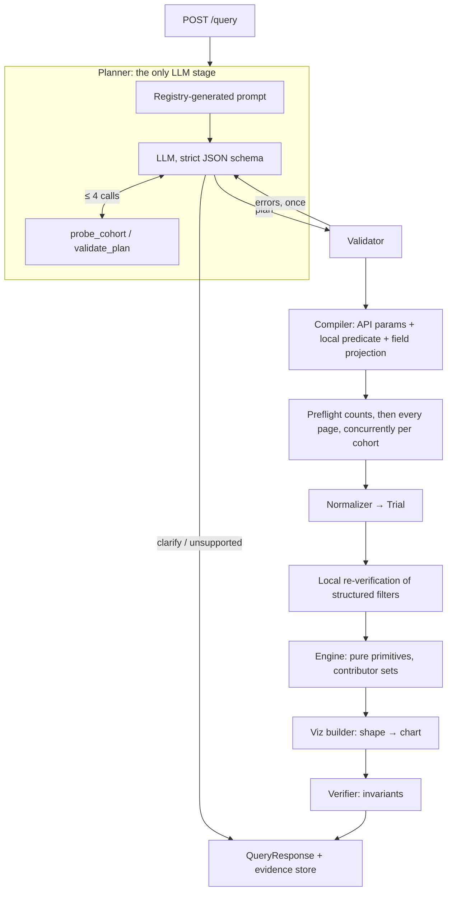

# ctgov-viz

Ask a question about clinical trials in plain English; get back **verified, visualization-ready
JSON** computed from the complete set of matching ClinicalTrials.gov records, with every bar,
line point, node and edge traceable to the exact studies and registry fields behind it.

```text
"Which countries have the most recruiting Phase 3 lung cancer trials?"
   -> choropleth-ready ranked bar chart: China 136, United States 89, France 65, ...
      each bar -> the full, paginated list of NCT IDs + the location values that placed them there
```

**Guiding rule: the LLM only interprets the question.** It produces a constrained query plan.
Validated code retrieves every matching record, computes every number, picks the chart, and
verifies the response before it is returned. There is no field in the model's output schema
where a count, an NCT ID or a chart value could go.

---

## Contents

1. [Quick start](#quick-start)
2. [API](#api)
3. [Architecture](#architecture)
4. [AI design and hallucination controls](#ai-design-and-hallucination-controls)
5. [What the numbers mean](#what-the-numbers-mean)
6. [Supported questions](#supported-questions)
7. [Output contract](#output-contract)
8. [Verification and testing](#verification-and-testing)
9. [Design decisions](#design-decisions)
10. [Limitations](#limitations)
11. [Repository layout](#repository-layout)

---

## Quick start

Requires Python 3.12+ and [uv](https://docs.astral.sh/uv/).

```bash
uv sync

# Run with Claude as the planner (any question); the key can also go in .env
export ANTHROPIC_API_KEY=sk-ant-...
uv run uvicorn app.api.main:app --reload

# ...or fully offline for the LLM (example questions only; data still comes live from CT.gov)
LLM_MODE=fake uv run uvicorn app.api.main:app --reload
```

```bash
curl -s localhost:8000/query -H 'content-type: application/json' \
  -d '{"question": "Compare pembrolizumab and nivolumab trials across phases."}'

# follow any evidence ref from the response
curl -s 'localhost:8000/query/<query_id>/evidence/r3?page=1&page_size=50'
```

A plan can also be submitted directly, skipping the LLM (this is how clarification options
are re-submitted):

```bash
curl -s localhost:8000/query -H 'content-type: application/json' -d @- <<'EOF'
{"plan": {"cohorts": [{"label": "Melanoma", "condition": "melanoma"}],
          "analysis": {"kind": "aggregate", "dimension": "phase"}}}
EOF
```

Configuration (environment variables or `.env`):

| Variable | Default | Meaning |
|---|---|---|
| `LLM_MODE` | `anthropic` | Planner provider: `anthropic`, `openai`, or `fake` (offline; answers only `examples/plans` questions) |
| `ANTHROPIC_API_KEY` | – | Enables the Claude planner |
| `ANTHROPIC_MODEL` | `claude-opus-5` | Claude planner model |
| `ANTHROPIC_EFFORT` | API default | Optional `low` … `max` effort for the planner |
| `OPENAI_API_KEY` / `OPENAI_MODEL` | – / `gpt-5-mini` | Used when `LLM_MODE=openai` |
| `MAX_STUDIES_PER_COHORT` | `20000` | Larger cohorts are refused with narrowing options, never sampled |
| `REQUEST_DEADLINE_S` | `90` | Retrieval deadline per request |
| `CTGOV_CONCURRENCY` | `3` | Parallel CT.gov requests (cohorts are fetched concurrently) |
| `PLANNER_MAX_TOOL_CALLS` | `4` | Tool-call budget per question |

## API

| Route | Purpose |
|---|---|
| `POST /query` | `{"question": ...}` or `{"plan": ...}` → `QueryResponse` |
| `GET /query/{query_id}` | A previously computed response (while cached) |
| `GET /query/{query_id}/evidence/{item_id}?page=&page_size=` | Every contributing study for one datum, with the source field values used |
| `GET /capabilities` | Supported analysis kinds, dimensions and measures (generated from the field registry) |
| `GET /schema` | JSON Schemas for `QueryRequest`, `QueryPlan`, `QueryResponse`, `EvidencePage`, `ErrorResponse` |
| `GET /health` | Liveness, CT.gov reachability and data timestamp, LLM availability |

`QueryResponse.status` is always one of:

| Status | HTTP | Meaning |
|---|---|---|
| `ok` | 200 | Complete, verified chart |
| `partial` | 200 | A later API page failed after retries; `meta.completeness.reason` says which |
| `empty` | 200 | Valid query, nothing matched; `message` explains, `meta.api_queries` shows the exact queries |
| `needs_clarification` | 200 | Ambiguous, or the cohort is too large for a complete analysis; each option is a complete plan |
| `unsupported` | 200 | Outside registration data (e.g. efficacy); suggests an answerable alternative |

Errors use `{"status": "error", "code", "message", "detail"}` with stable codes:
`invalid_request` / `plan_invalid` (422), `upstream_rejected` / `upstream_unavailable` (502),
`llm_unavailable` (503), `upstream_timeout` (504), `verification_failed` (500).

## Architecture



Data flows one way through typed contracts (`app/contracts`). Only the planner (LLM) and the
client (HTTP) do I/O; the engine, builder and verifier are pure functions.

| Component | Module | Responsibility |
|---|---|---|
| Contracts | `app/contracts/` | `QueryPlan`, `Trial`, `AnalysisResult`, `VisualizationSpec`, `QueryResponse` |
| Field registry | `app/registry/fields.py` | Every analyzable dimension: legal operations, extractor, source paths, ordering, API fields. The single extension point. |
| Validator / linter | `app/registry/` | Cross-field plan rules (reported all at once, for repair); code-generated disclosures |
| Planner | `app/planner/` | Prompt, strict output schema, tools, bounded loop, repair, Claude and OpenAI adapters, offline planner |
| Compiler | `app/ctgov/compiler.py` | Cohort → API parameters (pushdown), local predicate, search-text sanitization, field projection |
| Client | `app/ctgov/client.py` | Full pagination, retries with backoff and `Retry-After`, honest completeness |
| Normalizer | `app/normalize/` | Nested JSON → `Trial`: partial dates, per-study dedupe, countries → ISO3, intervention names |
| Engine | `app/analysis/` | `aggregate`, `cooccurrence`, `numeric_pair` built from reusable primitives |
| Viz builder | `app/viz/` | Chart type from analysis shape, encodings, palette, embedded Vega-Lite |
| Evidence | `app/evidence/store.py` | Contributor registry, paginated evidence, LRU result cache |
| Verifier | `app/verify/checks.py` | Rejects any response that violates an invariant |
| Pipeline / API | `app/pipeline.py`, `app/api/main.py` | Sequencing, statuses, error mapping |

**Adding a dimension** (e.g. "enrollment bucket" or "primary purpose") means adding one
`FieldDef` plus its API field names. The prompt, validator, `/capabilities`, engine, builder
and projection all pick it up; no intent-specific code exists anywhere.

## AI design and hallucination controls

The planner turns a question into a `QueryPlan`: 1–4 **cohorts** (ClinicalTrials.gov searches
with structured filters) and one **analysis**. It never sees or produces results.

| Control | How |
|---|---|
| Nowhere to put data | The output schema has only search terms, enums and analysis options: no counts, IDs or values |
| Strict decoding | Structured outputs with a strict JSON schema (Claude `output_config.format`, or OpenAI `response_format`) and strict tool inputs; an LLM-facing *draft* schema (all fields required, no defaults) is converted into `QueryPlan` in code |
| Enums, not prose | Status, phase, study type, dimensions and measures are closed enums |
| Registry-generated prompt | Dimensions and their legal operations are rendered from the same registry the validator uses, so they cannot disagree (tested) |
| Grounding tools | `probe_cohort` returns how many studies a cohort matches, plus 3 titles, so the model can fix a zero-hit term or narrow a too-broad one. `validate_plan` lets it self-check. Both are read-only, capped at 4 calls, and then withdrawn |
| One repair turn | Invalid output → the full list of validation errors → one retry → otherwise `plan_invalid` (never a guess) |
| Clarification as plans | Each clarification option is a complete validated plan the client can re-submit |
| Code-generated disclosures | What a number *means* (phase-filter inclusion, "recruiting" scope, start date vs activity, overlap semantics) is written by `registry/linter.py` and the engine, not by the model |
| Count scrubbing | Model-written assumption sentences that restate a probed study count are dropped |
| Verifier | Every cited NCT ID must be a fetched record that satisfies its cohort's filters |

Provider: Claude (`claude-opus-5`) by default, through a small provider-neutral `LLMClient`
interface (`app/planner/llm.py`); an OpenAI adapter is kept for `LLM_MODE=openai`. The Claude
adapter echoes each reply's raw content back unchanged (Claude's adaptive-thinking blocks must
survive the tool loop) and enables server-side refusal fallbacks (`fallbacks: "default"`), so a
safety-classifier decline is retried on Anthropic's recommended model rather than failing.

Evaluation: `tests/golden/questions.yaml` has 25 differently worded questions: all appendix
query types, paraphrases, a misspelled drug, ambiguous wording, and out-of-scope questions.
Each asserts *properties* of the plan (analysis kind, dimension, series, cohort terms,
filters), not exact JSON. Run with `uv run pytest -m live tests/golden` once
`ANTHROPIC_API_KEY` is set.

## What the numbers mean

| Topic | Rule |
|---|---|
| Unit | Distinct NCT IDs. Never sites, arms or conditions. Enforced structurally: a count *is* `len(contributors)` |
| Phase breakdown | One bucket per study; `[PHASE2, PHASE3]` → "Phase 2/3" (CT.gov's convention), so bars sum to the studies analyzed. "Not Reported" = no phase registered (typical for observational studies) |
| Phase filter | Matches studies whose phases *include* it: a Phase 3 filter includes Phase 2/3 studies (disclosed) |
| "Recruiting" | `overallStatus = RECRUITING` only (disclosed) |
| Year | Registered start date (actual or anticipated). Not "active during the year". Future years flagged; the current year flagged as partial; missing start dates counted |
| Country | Distinct site countries per study; a multinational study counts once per country, so bars can sum to more than the number of studies |
| Comparison | Cohorts are retrieved independently; a study in both counts in both series; overlap reported in `meta.cohort_overlap` |
| Network (study scope) | Two interventions listed in the same study. **Not** proof they were given together |
| Network (arm scope) | Two interventions assigned to the same arm group, i.e. given together. Used for "combination" questions |
| Network hygiene | Placebo/sham/usual-care comparators and assessment entries (imaging, biospecimen collection, questionnaires) are excluded by default (disclosed, configurable) |
| Intervention identity | Deterministic merging only: case, ™/®, doses, formulation and salt words, peeled brand/code parentheticals, and a fixed alias table (Keytruda/MK-3475 → pembrolizumab). No fuzzy matching; raw names are kept in the evidence |
| Duration | Start → primary completion in months; requires month precision on both dates |
| Search matching | Condition/intervention matching is ClinicalTrials.gov's own search, including its synonym expansion |

## Supported questions

All question classes use the same three analysis kinds:

| Class | Example | Chart |
|---|---|---|
| Trend | How many breast cancer trials started each year since 2015? | line |
| Trend comparison | Pembrolizumab vs nivolumab trial starts per year | multi-line |
| Distribution | How are pembrolizumab trials distributed across phases? | bar |
| Distribution | Most common intervention types for melanoma trials | bar |
| Top-k | Top sponsors of recruiting multiple sclerosis trials | horizontal bar |
| Comparison | Compare pembrolizumab and nivolumab trials across phases | grouped bar |
| Comparison | Compare sponsor categories across breast and prostate cancer trials | grouped bar |
| Cross-tab | Lung cancer trials by phase and lead-sponsor class | grouped bar |
| Geography | Which countries have the most recruiting Phase 3 lung cancer trials? | choropleth-ready ranked bar |
| Co-occurrence | Which interventions co-occur in melanoma studies? | network |
| Combinations | Which drugs are combined in the same arm in melanoma trials? | network |
| Bipartite | Network of sponsors and drugs for NSCLC trials | two-sided network |
| Numeric | How does enrollment relate to study duration for Phase 3 breast cancer? | scatter (log enrollment) |
| Clarify | "Show me the immunotherapy landscape" | 2–3 alternative plans |
| Too broad | "Cancer trials by country" (123k studies) | counted narrowing options |
| Unsupported | "Which drug has the best survival?" | explanation + alternative |

Real, verified responses for eight of these are in [`examples/responses/`](examples/responses/),
produced from [`examples/plans/`](examples/plans/) by `uv run python scripts/run_examples.py`.

## Output contract

Charts ship **already aggregated and ordered**; frontends never recompute. `schema_version`
`1.0`, full JSON Schema at `GET /schema`. Shortened real response for the country question:

```jsonc
{
  "status": "ok",
  "query_id": "q_e0adeada732c24e5",          // deterministic: plan + CT.gov data timestamp
  "visualization": {
    "type": "choropleth_bar",
    "title": "Lung cancer studies by country",
    "subtitle": "Recruiting · Phase 3 (incl. multi-phase) · distinct studies (NCT IDs)",
    "encoding": {                             // describes the chart as drawn
      "y": {"field": "country", "type": "nominal", "title": "Country",
            "sort": ["China", "United States", "France", "..."]},
      "x": {"field": "study_count", "type": "quantitative", "title": "Studies"},
      "tooltip": ["country", "study_count"]
    },
    "hints": {"orientation": "horizontal", "legend": false, "value_labels": true},
    "palette": {"Lung cancer": "#2a78d6"},
    "data": [
      {"country": "China", "iso3": "CHN", "study_count": 136,
       "evidence": {"total": 136, "sample": ["NCT01804686", "..."], "complete_inline": false,
                    "ref": "/query/q_e0adeada732c24e5/evidence/r0"}}
    ],
    "geo": {"iso3_field": "iso3", "value_field": "study_count", "color_ramp": ["#cde2fb", "..."]},
    "vega_lite": { "...": "ready-to-render Vega-Lite v5 spec of the same data" }
  },
  "meta": {
    "api_version": "2.0.5", "data_timestamp": "2026-09-23T09:00:05",
    "api_queries": [{"cohort": "Lung cancer", "url": "https://clinicaltrials.gov/api/v2/studies?...",
                     "total": 210, "fetched": 210, "pages": 1, "complete": true}],
    "completeness": {"complete": true},
    "studies_analyzed": 210,
    "definitions": {"country": "Distinct site countries per study; ...", "unit": "..."},
    "assumptions": ["A phase filter keeps studies whose registered phases include that phase, ..."],
    "warnings": ["Showing the top 20 of 60 country values by study count."],
    "llm": {"model": "offline-examples", "tool_calls": [], "repaired": false},  // LLM_MODE=fake
    "timings_ms": {"preflight": 140, "fetch": 357, "analyze": 12, "verify": 0, "total": 511}
  }
}
```

- **Networks** carry `nodes` (`id`, `label`, `group`, `study_count`, `evidence`) and `edges`
  (`source`, `target`, `weight`, `evidence`) instead of `data`.
- **Scatter** rows are one study each (`nct_id`, both measures, phase, study URL).
- **Evidence pages** list `nct_id`, study URL, title and `fields_used`: the raw registry values
  (by API field path) that put the study in that group, e.g. its location countries for a
  country bar, or its registered intervention names and how each was resolved for a network edge.
- **Colors** come from a fixed, colour-vision-deficiency-validated categorical order, assigned
  per entity (never by rank). A 9th series folds into "Other" (a real distinct-study union,
  computed in the engine). Networks and maps use only the 3 slots that stay distinguishable
  when any two marks can touch.

## Verification and testing

```bash
uv run pytest                      # 201 unit + integration tests, no network (~3 s)
uv run pytest -m live tests/live   # live CT.gov oracle tests
uv run pytest -m live tests/golden   # planner golden set (needs ANTHROPIC_API_KEY)
uv run ruff check . && uv run mypy app
```

| Layer | What is tested |
|---|---|
| Unit | Normalizer on 15 **real recorded studies** chosen by edge case (multi-phase, missing start date, repeated site countries, placebo arms, ™ names, ...), intervention-name resolution (merges and deliberate non-merges), countries, compiler and predicates, every validator rule, engine results on hand-computed cohorts, builder encodings, planner loop (tools, budget, repair, clarify, scrubbing), strict-schema compatibility |
| Property (hypothesis) | For random cohorts: phase buckets partition the cohort; country counts equal distinct studies; edge weight ≤ both endpoint counts; output is identical under input shuffling |
| Projection | Every example plan gives identical results on full and field-projected records (and the test fails if a needed field is dropped) |
| Verifier | Each invariant is proven by an injected fault (wrong count, uncited study, filter violation, misordered rows, missing zero rows, self-loops, status/completeness mismatch, ...) |
| Integration | Real client + pipeline + FastAPI against an in-process fake CT.gov: paging, duplicates across pages, retries (503, 429 + `Retry-After`, non-JSON 200), no retry on 400, partial results, too-broad refusal, error codes, evidence paging, caching |
| Live oracles | Demo plans run against the real API; results re-derived with **independent** Essie count queries, and cited studies re-fetched to check field-level evidence |

Live oracle results (2026-09-23 data snapshot): every checked number matched exactly.

| Check | Independent API count | Service |
|---|---|---|
| Pembrolizumab, Phase 3 only | 324 | 324 |
| Pembrolizumab, no phase registered | 171 | 171 |
| Recruiting Phase 3 lung cancer: China / United States | 136 / 89 | 136 / 89 |
| Breast cancer studies starting in 2019 / 2022 | 862 / 999 | 862 / 999 |

Cold latency on the live API: 0.5 s (210 studies) to 8.3 s (10,685 studies, 11 sequential
pages); repeated plans are served from cache.

## Design decisions

1. **Cohorts + one analysis, not intents.** "A vs B" is two cohorts with `series_by="cohort"`;
   a trend is an aggregate with a time axis. Three analysis kinds cover every question class.
2. **Structured filters are pushed down *and* re-verified locally.** Filters go to the API for
   smaller downloads, and every cited study provably satisfies them. Free-text matching is left
   to CT.gov, whose synonym expansion beats anything hand-rolled.
3. **Complete or explicit.** Preflight counts; cohorts over 20k are refused with counted
   narrowing options rather than analyzed on a biased first-N sample; a failed later page
   yields `partial`, never a silently short chart; data refreshes during retrieval are flagged.
4. **Counts cannot drift from evidence.** Groups are dicts keyed by NCT ID; a count is their
   length; the verifier re-checks against the evidence store.
5. **Phase = one bucket per study.** Bars sum to the cohort, the most honest distribution;
   "explode" semantics would double-count multi-phase studies.
6. **Deterministic everything.** Domain orders, count-descending with alphabetical
   tie-breaks, zero-filled years and aligned series. The same plan on the same data snapshot
   gives the same bytes and the same `query_id`.
7. **Chart type follows the analysis shape**, chosen by code.
8. **The verifier rejects rather than repairs.** A wrong chart is worse than none.
9. **Conservative normalization, informed by real data.** Rules were written from surveys of
   ~16k real intervention names and 157 country spellings. Merges are exact-match only, and
   anything that changes identity (e.g. peptide variants such as `gp100:209-217(210M)`) is
   kept distinct.
10. **Plain Python, no agent framework.** Provenance is clearer as explicit contributor sets;
    the bounded tool loop and its output handling are about 80 lines.

## Limitations

- Registration data only: no efficacy, outcomes or adverse-event analysis (`unsupported`).
- Cohorts above 20,000 studies are refused; ask a narrower question.
- Search recall and precision are ClinicalTrials.gov's: e.g. a multi-cancer extension study can
  match "lung cancer".
- Intervention merging uses a fixed alias table for 46 common oncology agents; other brand
  names stay separate nodes. Combination products registered under one name stay one node.
  "IL-2" and "aldesleukin" are not merged.
- Conditions are grouped by registered string (no MeSH roll-up).
- "Active during year X" timelines are not implemented (start year only).
- The evidence store and cache are in-memory; refs expire on restart. The response's plan
  and `meta.api_queries` URLs make every result reproducible.
- The LLM planner needs an Anthropic (or OpenAI) key; without one, `LLM_MODE=fake` answers
  the example questions and plans can always be submitted directly.

## Repository layout

```text
app/
  api/main.py          HTTP routes and error mapping
  pipeline.py          orchestration
  contracts/           typed contracts between stages
  registry/            field registry, plan validator, disclosure linter
  planner/             prompt, strict schema, tools, LLM loop, Claude + OpenAI adapters, offline
  ctgov/               API client and query compiler
  normalize/           study JSON -> Trial (dates, countries, intervention names, labels)
  analysis/            engine + pure primitives
  viz/                 chart builder, titles, theme
  evidence/            evidence registry and result cache
  verify/              response invariants
examples/plans/        demo questions with hand-checked plans
examples/responses/    verified live responses for those plans
scripts/               fixture capture, example runner
tests/                 unit, integration (fake CT.gov), golden (LLM), live (oracles)
PLAN.md                original design and implementation plan
```
