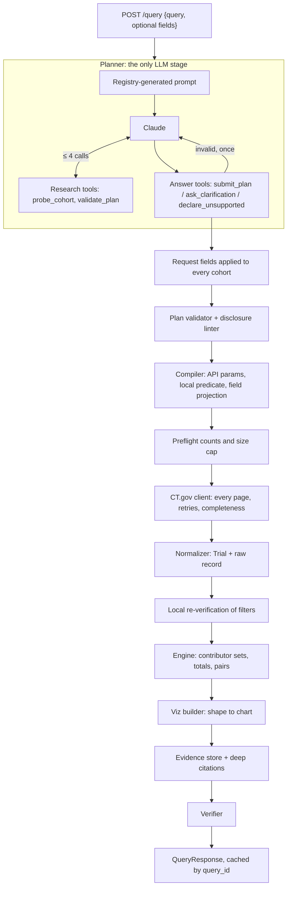

# ctgov-viz: System Design Report

**What it is.** A backend service that answers natural-language questions about clinical trials
with verified, visualization-ready JSON computed from the *complete* set of matching
ClinicalTrials.gov records. Every chart datum cites the exact studies and record text behind it.

**Core principle.** The LLM only *interprets* the question. It emits a constrained query plan;
deterministic, tested code retrieves every record, computes every number, chooses the chart, and
verifies the result before anything is returned. No count, NCT ID or chart value can originate
from the model.

**Headline results** (2026-09-23 ClinicalTrials.gov data snapshot):

| Measure | Result |
|---|---|
| Planner evaluation (29 differently worded questions, `claude-opus-5`) | 29/29 |
| Numbers checked against independent ClinicalTrials.gov count queries | all exact (e.g. 191/191, 184/184, 862/862) |
| Citation excerpts re-checked against freshly downloaded full records | all verbatim at their paths |
| Automated tests | 271 offline + 37 live |
| End-to-end latency | ~10–20 s (planning ~9 s; retrieval 0.5–8 s cold) |

---

## Contents

1. [Requirements and how the design meets them](#1-requirements-and-how-the-design-meets-them)
2. [Architecture](#2-architecture)
3. [Request lifecycle](#3-request-lifecycle)
4. [Components](#4-components)
5. [Data contracts](#5-data-contracts)
6. [Counting semantics](#6-counting-semantics)
7. [Failure handling and completeness](#7-failure-handling-and-completeness)
8. [Performance](#8-performance)
9. [Security and safety](#9-security-and-safety)
10. [Verification strategy](#10-verification-strategy)
11. [Extensibility](#11-extensibility)
12. [Key decisions and alternatives considered](#12-key-decisions-and-alternatives-considered)
13. [Limitations and future work](#13-limitations-and-future-work)
14. [Appendix: code map](#14-appendix-code-map)

---

## 1. Requirements and how the design meets them

| Requirement | Design response |
|---|---|
| Interpret a natural-language question | LLM planner with registry-generated prompt, read-only grounding tools, answer tools validated in code, one repair turn |
| Required `query` + optional structured fields | `QueryRequest`: `query` plus `drug_name`, `condition`, `sponsor`, `country`, `trial_phase`, `status`, `start_year`, `end_year`, enforced as hard constraints in code |
| Retrieve relevant data from ClinicalTrials.gov | Compiler pushes filters to API v2; client fetches **every** page with retries; filters re-verified locally |
| Choose a suitable visualization | Chart type is a pure function of the analysis *shape*, decided by code, not the LLM |
| Structured visualization spec | Versioned `VisualizationSpec`: type, title, encodings with explicit sort orders, pre-aggregated data, palette, hints, optional Vega-Lite |
| Multiple chart types | bar, grouped bar, stacked bar with totals, histogram, line/time series, choropleth-ready ranking, network, scatter |
| Response metadata | Units, definitions, assumptions, warnings, effective filters, exact API queries, completeness, timings |
| Bonus: deep citations | Every datum carries `citations`: NCT ID plus verbatim excerpts at exact record paths |
| Avoid hallucination-prone steps | LLM output has nowhere to put data; every number and ID is computed and verified by code |

## 2. Architecture

**Dependency rule.** `contracts` depends on nothing; everything else depends on `contracts` and
data flows one way. Only two modules do I/O: the planner (LLM) and the ClinicalTrials.gov client.
The engine, builder, citation builder and verifier are pure functions, unit-tested with records
built in memory or recorded from the real API.

**Size.** About 5,100 lines of Python across 10 packages, a 400-line static demo page, and
2,700 lines of tests.

## 3. Request lifecycle

Worked example: `{"query": "Which countries have the most trials?", "condition": "lung cancer",
"trial_phase": "Phase 3", "status": "recruiting"}`.

1. **Parse** (`app/contracts/request.py`). Pydantic validates the body; `"Phase 3"` and
   `"recruiting"` are leniently parsed into closed enums (`PHASE3`, `RECRUITING`). Unknown
   fields are rejected.
2. **Plan** (`app/planner/`). Claude receives the question plus a note that the structured
   fields are hard constraints. It may call `probe_cohort` (how many studies match this search?)
   and finishes by calling `submit_plan` with a draft `QueryPlan`: one cohort (condition "lung
   cancer", status and phase filters) and an aggregate by `country`, `top_k` 20, sorted by count.
3. **Enforce fields** (`app/registry/request_fields.py`). The request's `condition`,
   `trial_phase` and `status` overwrite the corresponding plan fields on every cohort, and each
   application is recorded as an assumption.
4. **Validate and disclose** (`app/registry/validator.py`, `linter.py`). Cross-field rules are
   checked. Code writes the disclosures that define what the numbers mean, e.g. "a Phase 3 filter
   includes Phase 2/3 studies" and "'recruiting' means overall status RECRUITING only".
5. **Compile** (`app/ctgov/compiler.py`). Produces API v2 parameters (`query.cond`,
   `filter.overallStatus`, `filter.advanced=AREA[Phase]PHASE3`), a local predicate that re-checks
   every structured filter, and the minimal `fields=` list this plan reads.
6. **Preflight** (`app/pipeline.py`). A count request per cohort, run concurrently. Zero matches
   returns `empty`; more than 20,000 returns `needs_clarification` with *counted* narrowing
   options instead of analyzing a biased sample.
7. **Retrieve** (`app/ctgov/client.py`). Every page (1,000 studies each, cursor-paginated), with
   bounded retries. The data timestamp is read before and after, to flag a mid-fetch refresh.
8. **Normalize and re-verify** (`app/normalize/`). Each raw study becomes a `Trial` that keeps
   its raw record for citations. Studies failing the local predicate are dropped and counted.
9. **Analyze** (`app/analysis/engine.py`). Each country maps to a set of NCT IDs; count =
   set size; ranked by count with deterministic tie-breaks; top 20 kept (disclosed).
10. **Build** (`app/viz/builder.py`). Shape `geo` becomes a `choropleth_bar` (horizontal
    ranked bars plus ISO3 codes for maps). Every row registers its contributors and receives
    inline citations.
11. **Verify** (`app/verify/checks.py`). Invariants are checked; any violation becomes a 500
    `verification_failed` instead of a wrong chart.
12. **Respond and cache.** A deterministic `query_id` (hash of plan + data snapshot) keys an LRU
    holding the response and its evidence, so evidence links keep working.

## 4. Components

### 4.1 API layer (`app/api/main.py`)

Thin: parsing, routing, and error mapping only.

| Route | Purpose |
|---|---|
| `POST /query` | query (+ optional fields) → verified `QueryResponse` |
| `GET /query/{id}` | cached response |
| `GET /query/{id}/evidence/{item}?page=&page_size=` | every contributing study of one datum, with full citations |
| `GET /capabilities` | supported dimensions, operations and measures (generated from the registry) |
| `GET /schema` | JSON Schemas of all contracts |
| `GET /health` | liveness, ClinicalTrials.gov reachability and data timestamp, LLM availability |
| `GET /` | demo UI |

Domain outcomes (`ok`, `partial`, `empty`, `needs_clarification`, `unsupported`) are HTTP 200 with
a discriminating `status`. Failures use stable error codes: `invalid_request`, `plan_invalid`,
`conflicting_fields` (422); `upstream_rejected`, `upstream_unavailable` (502); `llm_unavailable`
(503); `upstream_timeout` (504); `verification_failed` (500).

### 4.2 Planner (`app/planner/`)

**Job:** question → `QueryPlan`, clarification, or refusal. Nothing else.

- **Plan shape.** 1–4 *cohorts* (each a ClinicalTrials.gov search with structured filters) and
  one *analysis* of three kinds: `aggregate` (by a dimension or by start year, optionally split
  into series), `cooccurrence` (network), `numeric_pair` (scatter). Comparisons are simply
  multiple cohorts with `series_by="cohort"`. There is no per-intent code.
- **Prompt generated from the field registry.** Dimensions, their legal operations and
  descriptions are rendered from the same registry the validator uses, so they cannot drift; a
  test enforces this. Seven validated few-shot examples cover plans, clarification and refusal.
- **Research tools** (read-only, at most 4 calls per question):
  - `probe_cohort` returns a cohort's match count and three titles. This grounds search terms:
    the misspelled "pembrolizimab" is corrected, zero-hit terms are retried, and over-broad
    cohorts are narrowed.
  - `validate_plan` lets the model self-check a draft.
- **Answer tools** end the loop: `submit_plan`, `ask_clarification` (2–3 options, each a complete
  plan), `declare_unsupported` (outcome and efficacy questions, off-topic questions). Free-text
  replies are rejected.
- **Validation over decoding.** Small schemas (`probe_cohort`, `declare_unsupported`) use strict,
  grammar-constrained decoding. Plan-carrying arguments are validated in code: Pydantic, then the
  semantic validator. See [decision D5](#12-key-decisions-and-alternatives-considered) for why.
- **One repair turn.** An invalid answer gets the full list of problems as the tool result;
  a second failure is `plan_invalid`, never a guess.
- **Count scrubbing.** Model-written assumption sentences that repeat a probed study count are
  dropped, since counts may only come from the pipeline.
- **Provider isolation.** A provider-neutral conversation (`UserMessage`, `LLMReply`,
  `ToolResult`) with adapters for Anthropic (default, `claude-opus-5`, server-side refusal
  fallbacks enabled, thinking blocks echoed back verbatim) and OpenAI. An offline planner
  (`LLM_MODE=fake`) answers the curated example questions, and a scripted LLM drives tests.

### 4.3 Request fields, validator and linter (`app/registry/`)

- **Request fields as hard constraints.** Applied to *every* cohort after planning, overriding
  the model's reading and recorded in `meta.assumptions`. A field that would merge a requested
  comparison (e.g. `drug_name` set on "compare pembrolizumab and nivolumab") returns
  `422 conflicting_fields` instead of silently dropping one side.
- **Validator.** Cross-field rules the schema cannot express: cohort count and uniqueness, legal
  dimension/operation combinations, series rules, year ranges, `top_k` and edge bounds, no
  unbounded cohorts. Returns *all* errors at once, so the repair turn can fix everything.
- **Disclosure linter.** Emits the assumptions and definitions that determine what a number means.
  They come from the plan, never from LLM wording, so they are always present.

### 4.4 Field registry (`app/registry/fields.py`): the extension point

Each analyzable dimension is one `FieldDef`: title, legal operations (`group`, `series`,
`pair`), extractor (`Trial` → keys), source paths, ordering (domain order or count), default
top-k, multi-valued flag, histogram flag, and the API fields it needs. Eleven dimensions:
phase, overall status, study type, lead sponsor, sponsor class, intervention, intervention type,
condition, country, enrollment size (binned), duration (binned).

The prompt, validator, `/capabilities`, engine, builder, field projection and citation layer all
read from it.

### 4.5 Compiler (`app/ctgov/compiler.py`)

- **Pushdown *and* re-verification.** Structured filters go to the API (smaller downloads) *and*
  become a local predicate re-checked on every normalized study, so every cited study provably
  satisfies them. Free-text search is left to ClinicalTrials.gov, whose synonym expansion
  (Keytruda / MK-3475 → pembrolizumab) is better than anything hand-rolled.
- **Time-window pushdown.** A trend's year range becomes `AREA[StartDate]RANGE[...]`. Studies
  without a start date are then counted with one `AREA[StartDate]MISSING` query rather than
  downloaded.
- **Field projection.** Only the fields the plan reads are requested, about 10× smaller pages
  for a trend. An equivalence test proves projected and full records give identical analyses,
  and the test fails if a needed field is dropped.
- **Sanitization.** Search text is stripped of Essie operators (`AREA[...]`, `RANGE[...]`) and
  control characters, so user wording cannot inject filter syntax.

### 4.6 ClinicalTrials.gov client (`app/ctgov/client.py`)

- **Pagination:** cursor pagination at the API's 1,000-per-page maximum, with duplicates across
  pages removed.
- **Retries:** bounded retries with exponential backoff for timeouts, transport errors, 429/5xx
  (honoring `Retry-After`) and 200 responses with non-JSON bodies, which were seen in practice
  under load.
- **No retry on 400:** the API's message is surfaced as `upstream_rejected`.
- **Honest completeness contract:** `fetch_all` returns every study the API reports, or says
  exactly why it stopped. A failure on page 1 raises; a later failure yields a labeled partial
  result. It never silently returns fewer studies than the API reported.

### 4.7 Normalizer (`app/normalize/`)

Nested, optional-everywhere JSON becomes a frozen `Trial`. Missing values stay explicit; nothing
is imputed.

- **Raw record retained.** Each `Trial` keeps the `protocolSection` exactly as returned, the
  source of truth for citations.
- **Per-study deduplication.** Repeated site countries (seven "United States" sites count once),
  duplicate conditions, and different spellings of one drug are collapsed within a study.
- **Intervention identity** (rules written after surveying ~16k real names):
  - drop trademark symbols; peel brand/code parentheticals, except amino-acid variant markers
    such as `(210M)`;
  - strip doses, formulation words and salt words;
  - map a fixed alias table of 46 oncology agents (Keytruda / MK-3475 → pembrolizumab);
  - no fuzzy matching.
  - Assessment entries registered as "interventions" (biospecimen collection, imaging,
    questionnaires) and placebo/usual-care comparators are flagged and excluded from networks
    by default, with disclosure.
- **Countries.** Canonical names with ISO3 codes; overrides written from a survey of 157 real
  spellings (e.g. "Turkey (Türkiye)", "Korea, Republic of"). The country filter matches by ISO3.
- **Dates.** Partial dates ("2019", "2019-05") keep their precision; duration requires month
  precision on both ends.

### 4.8 Analysis engine (`app/analysis/`)

- **Counts cannot drift from evidence.** Every group is a dict keyed by NCT ID, and a count is
  its length, so double counting within a group is structurally impossible.
- **Three kinds, reusable primitives:**
  - aggregate: categorical or temporal, zero-filled years, aligned series with explicit zeros;
  - co-occurrence: study scope or arm scope ("given together"), unordered pairs, bipartite
    pairs;
  - numeric pair: two measures per study.
- **Totals and partition detection.** For series breakdowns the engine computes each category's
  *distinct* total across all series (never a sum) and checks whether the series partition
  every category, i.e. each study is in exactly one series.
- **Deterministic ordering.** Domain orders; count descending with alphabetical tie-breaks; years
  ascending. Output is identical under input shuffling (property-tested).
- **Palette-aware folding.** A ninth series folds into "Other" as a real distinct-study union,
  because the categorical palette has eight validated colors.

### 4.9 Visualization builder (`app/viz/`)

Chart type is chosen by code from the analysis shape:

| Shape | Chart |
|---|---|
| category | `bar` (horizontal when ranked or labels are long) |
| category × series, series partition, breakdown | `stacked_bar`, bar length = total, total labeled |
| category × series, series overlap | `grouped_bar` + total marker per category |
| category × cohort (comparison) | `grouped_bar` (totals shipped, not drawn) |
| binned numeric | `histogram` |
| year (× series) | `line` |
| country | `choropleth_bar` (ranked bars + ISO3 + color ramp) |
| pairs | `network` (nodes, edges, groups) |
| two measures | `scatter` (log enrollment) |

- **Encodings describe the chart as drawn,** with explicit `sort` arrays.
- **Titles and subtitles** are deterministic templates built from the plan.
- **Colors** come from a fixed, colour-vision-deficiency-validated categorical order assigned
  per entity, never by rank. Forms where any marks can touch (network, map) use only the three
  slots that stay distinguishable pairwise.
- **Optional Vega-Lite v5 spec.** An embedded, ready-to-render spec whose values carry `_row`
  indices mapping clicks back to evidence.

### 4.10 Evidence and deep citations (`app/evidence/`)

- **Claims.** Each datum *claims* something about its studies, such as "phase bucket = Phase
  2/3", "has a site in South Korea", "lists both nivolumab and ipilimumab", or "belongs to the
  cohort 'Pembrolizumab'".
- **Per-dimension citers.** Each dimension has a citer that finds the supporting values in the
  raw record and cites them by exact path, list index included, e.g.
  `protocolSection.contactsLocationsModule.locations[52].country = "China"`.
- **Cohort membership is cited too:** the verbatim search match and each structured filter.
- **Verbatim by construction.** Excerpt text is read from the record at the cited path.
- **Honest about gaps.** When a claim rests on an absent value, or on ClinicalTrials.gov's search
  expansion rather than a verbatim match, the excerpt has `text: null` and says so.
- **Where citations appear.** Inline for each datum's evidence sample (5 studies). The evidence
  endpoint pages through all contributors in the same format.
- **Coverage enforced.** A test fails if a registry dimension lacks a citer.

### 4.11 Verifier (`app/verify/checks.py`)

It re-derives facts from the fetched studies and the evidence store and **rejects, never
repairs**:

- count = evidence total = distinct registered contributors;
- every cited NCT ID is well-formed, was fetched, and satisfies its cohort's filters;
- every inline citation cites a contributor, and every excerpt is verbatim at its path;
- rows follow series × category order with explicit zeros, and years are contiguous;
- totals equal their evidence, lie within [largest series, sum of series], and stacked series
  add up exactly;
- network edges reference existing nodes, have no self-loops or duplicates, and weigh no more
  than either endpoint;
- single-valued breakdowns account for every fetched study;
- status agrees with completeness;
- payload bounds hold (rows, nodes, edges, points, ≤ 3 MB).

Each check is proven by an injected-fault test.

### 4.12 Pipeline and caching (`app/pipeline.py`)

Sequences the stages above, maps upstream errors to stable codes, enforces a 90 s retrieval
deadline, and times each stage into `meta.timings_ms`.

`query_id` = hash(canonical plan, data timestamp). The same plan against the same data
snapshot therefore returns the same id and bytes, and an in-process LRU (128 entries) serves
repeated plans and evidence pages.

### 4.13 Demo UI (`app/static/index.html`)

A single static page served at `/`, with no build step. It uses vega-embed for standard charts
and a d3 force layout for networks (drag, zoom, neighbor highlight).

- **Inputs:** a question box, example chips and the optional structured fields.
- **Citations:** clicking any bar, point, node, edge or total opens its citations, with "Load
  all" paging through the evidence endpoint.
- **Other panels:** clarification options as buttons, a data table, the exact API queries, and
  the raw JSON.
- **Testing:** rendered and click-tested in headless Chrome.

## 5. Data contracts

**Request.** Only `query` is required (1–1000 chars). Optional fields: `drug_name`,
`condition`, `sponsor`, `country`, `trial_phase` (accepts "Phase 3", "Phase 2/3", "3", …),
`status` (accepts "recruiting", "completed", …), `start_year`, `end_year`. There is also an
advanced `plan` (execute this plan; used to re-submit a clarification option). Unknown fields
are rejected.

**QueryPlan** (the LLM's only product): `cohorts[1..4]` {label, condition, intervention,
term, sponsor, filters {overall_status[], phase[], study_type, start_date_from/to, country}} and
`analysis` {kind, dimension | time, series_by, pair {left, right, scope, drugs_only,
exclude_placebo, exclude_ancillary, max_edges}, x/y measure, top_k, sort}. No field can hold a
count, an NCT ID or chart data.

**Response.** `status`, `query_id`, `query`, `plan` (what actually ran), `visualization`,
`clarification`, `message`, `meta`:
- `meta` holds definitions, assumptions, warnings, `filters` (effective per cohort),
  `request_fields`, `api_queries` (reproducible URLs with totals, pages and completeness),
  `completeness`, `studies_analyzed`, `cohort_overlap`, `excluded`, `llm` (model, tool calls,
  repaired), and `timings_ms`.

**VisualizationSpec** (`schema_version` 1.0):
- **Top-level fields:** `type`, `title`, `subtitle`, `encoding` (x/y/color/size channels with
  types, titles, explicit sort, scale), `hints` (orientation, legend, value labels, stacked,
  show_totals, layout), `palette`.
- **Data:** `data` (rows with `study_count`, `evidence`, `citations`), `totals` (breakdowns),
  `nodes` and `edges` (networks), `geo`, `vega_lite`.

**Citation:** `nct_id`, `title`, `url`, `record_url`, `excerpt`, `excerpts[]` {field, text,
supports}.

All schemas are published at `GET /schema`.

## 6. Counting semantics

| Topic | Rule |
|---|---|
| Unit | Distinct NCT IDs; never sites, arms or conditions |
| Phase breakdown | One bucket per study (`[PHASE2, PHASE3]` → "Phase 2/3"), so buckets partition the cohort |
| Phase filter | Includes studies whose phases *contain* it (Phase 3 filter includes Phase 2/3), disclosed |
| "Recruiting" | `overallStatus = RECRUITING` only, disclosed |
| Year | Registered start date (actual or anticipated), not "active during"; future and partial years flagged |
| Country | Distinct site countries per study; a multinational study counts once in each |
| Comparison | Cohorts retrieved independently; a study in both counts in both series; overlap reported |
| Totals | Distinct studies per category across all series, computed by the engine, never summed |
| Network (study) | Both listed in the same study; not proof of co-administration |
| Network (arm) | Both assigned to the same arm group, i.e. given together |
| Duration | Start → primary completion in months; needs month precision on both dates |

## 7. Failure handling and completeness

| Situation | Outcome |
|---|---|
| Nothing matches | `empty` with a message and the exact API queries |
| Cohort > 20,000 studies | `needs_clarification`, with narrowing options whose counts were checked |
| A later page fails after retries | `partial` with `completeness.reason`, never a silently short chart |
| First page fails / API down | 502 `upstream_unavailable` |
| API rejects the query (400) | 502 `upstream_rejected` with the API's message, not retried |
| Retrieval exceeds 90 s | 504 `upstream_timeout` |
| Data refreshed during retrieval | Warning |
| Question ambiguous | `needs_clarification`, each option a complete plan |
| Outside registration data | `unsupported` with an answerable alternative |
| Model output invalid twice | 422 `plan_invalid` with the validation messages |
| LLM misconfigured or unreachable | 503 `llm_unavailable` with the provider's message |
| Request field contradicts the comparison | 422 `conflicting_fields` |
| Any invariant violated | 500 `verification_failed`; the chart is not returned |

## 8. Performance

- **Planning** is the dominant cost: about 9 s per question on `claude-opus-5`
  (`ANTHROPIC_EFFORT` can trade accuracy for speed).
- **Retrieval** measured cold: 0.5 s (210 studies) to 8.3 s (10,685 studies, 11 sequential
  pages). Pages of one cohort are sequential because the API uses a cursor; cohorts are fetched
  concurrently (limit 3).
- **Data reduction:** field projection (~10× smaller pages), time-window pushdown (skips
  out-of-range studies), and a preflight count before any download.
- **Payload control:** 5 inline citations per datum with the rest paginated; scatter points
  cite only their plotted values inline (a 1,424-point scatter is ~1.5 MB); `max_edges` and
  `top_k` bound networks; a verifier bound of 3 MB.
- **Caching:** deterministic `query_id` plus an LRU makes repeated plans instant within a
  process.

## 9. Security and safety

- **Secrets** only in environment variables or a git-ignored `.env`; `.env.example` is the
  template. The git history was scanned before publishing.
- **Search-syntax injection** is prevented by sanitizing free text before it reaches Essie.
- **Prompt injection has a bounded blast radius.** The model's only tools are read-only count and
  title lookups on a public API, and its only output is a plan that is validated, re-verified
  and executed by code. A manipulated question can at worst produce a strange but valid public
  query; it cannot fabricate numbers or citations, since the verifier checks both.
- **Not production-hardened:** no authentication, no rate limiting, and CORS open to all origins
  for the demo. These belong in front of any public deployment.

## 10. Verification strategy

| Layer | What it proves |
|---|---|
| Unit | Normalizer on 15 real recorded studies chosen by edge case; name resolution (merges and deliberate non-merges); compiler and predicates; every validator rule; engine results on hand-computed cohorts; builder encodings; planner loop (tools, budget, repair, clarification, scrubbing); request parsing and field enforcement |
| Property (hypothesis) | For random cohorts: phase buckets partition; country counts are distinct studies; edges ≤ both endpoints; output is independent of input order |
| Projection | Full and projected records give identical analyses |
| Citations | Every excerpt resolves verbatim for every chart type on real records |
| Verifier | Every invariant caught by an injected fault |
| Integration | Real client, pipeline and FastAPI against an in-process fake ClinicalTrials.gov: paging, duplicates, retries, partial results, error codes, caching |
| Live oracles | Results re-derived with **independent** Essie count queries; cited studies' full records re-downloaded and every excerpt checked at its path |
| Golden planner set | 29 questions asserting plan *properties*: 29/29 |
| UI | Headless Chrome rendering and click tests |

Examples of independent cross-checks (all exact):

| Check | Direct API count | Service |
|---|---|---|
| Pembrolizumab, Phase 3 only / no phase | 324 / 171 | 324 / 171 |
| Recruiting Phase 3 lung cancer: China / US | 136 / 89 | 136 / 89 |
| Breast cancer starting in 2019 / 2022 | 862 / 999 | 862 / 999 |
| Recruiting interventional Ph2/3 breast cancer, 2020–24: US / China totals | 191 / 184 | 191 / 184 |
| Interventional breast cancer: recruiting started 2024 / completed started 2015 | 386 / 328 | 386 / 328 |

## 11. Extensibility

- **New dimension** (e.g. primary purpose, allocation): add one `FieldDef`, its API field names
  and a citer. The prompt, validator, `/capabilities`, engine, builder, projection and citations
  pick it up; tests fail if the citer is missing.
- **New chart form:** the builder maps a shape to a spec. Adding a shape means one engine branch
  and one builder function; the contract is versioned.
- **New LLM provider:** implement one adapter over the neutral conversation types.
- **New data source or field:** the client, compiler and normalizer are isolated behind `Trial`.

## 12. Key decisions and alternatives considered

| # | Decision | Why | Alternative rejected |
|---|---|---|---|
| D1 | LLM produces a plan, never data | Removes the hallucination surface for numbers and IDs | LLM summarizing or counting fetched records |
| D2 | Cohorts + one analysis kind | Every question class without per-intent code | An intent classifier with a handler per intent |
| D3 | Filters pushed down *and* re-verified | Small downloads and provable evidence | Trusting API filtering alone |
| D4 | Refuse over-cap cohorts | A first-N sample is biased by API sort order | Silently sampling |
| D5 | Answer tools validated in code, strict decoding only for small schemas | Measured: the plan schema exceeds Claude's decoding-grammar limit once a second copy or any strict tool is added; code validation scales with the registry | Shrinking the schema to fit (breaks with the next dimension) |
| D6 | Phase = one bucket per study | Bars sum to the cohort | "Explode" semantics (double-counts multi-phase studies) |
| D7 | Totals computed, partition detected | Series can overlap; summing them would be wrong | Letting frontends sum series |
| D8 | Citations read from the raw record by path | Verbatim by construction, mechanically checkable | Re-serializing normalized values |
| D9 | Verifier rejects rather than repairs | A wrong chart is worse than none | Best-effort fixes |
| D10 | Deterministic normalization + alias table | Auditable; raw names kept in evidence | Fuzzy or embedding-based merging |
| D11 | Plain Python, no agent framework | Provenance is explicit; the loop is ~80 lines | An agent framework |

## 13. Limitations and future work

**Limitations:**
- Registration data only: efficacy, outcome and adverse-event questions are declined.
- Cohorts above 20,000 studies are refused.
- Search recall and precision are ClinicalTrials.gov's; citations disclose synonym-expansion
  matches.
- The alias table covers 46 oncology agents.
- Conditions are grouped by registered string, with no MeSH roll-up.
- There is no "active during year X" view.
- The evidence cache is in-memory, and there is no authentication or rate limiting.

**Next steps:**
- A persistent per-study cache keyed by data snapshot, for near-instant repeated questions.
- RxNorm/MeSH-based identity for drugs and conditions.
- Interval-based activity timelines, and a strict-phase option.
- A real map for geographic results.
- Durable evidence storage (SQLite or Redis).
- A larger evaluation set drawn from real user questions.

## 14. Appendix: code map

| Package | Lines | Contents |
|---|---|---|
| `app/api` | 201 | routes, error mapping |
| `app/planner` | 836 | prompt, draft schemas, research/answer tools, loop, Anthropic/OpenAI adapters, offline planner |
| `app/contracts` | 667 | request, plan, trial, analysis, visualization, response |
| `app/registry` | 443 | field registry, validator, disclosure linter, request-field enforcement |
| `app/ctgov` | 347 | client, compiler, errors |
| `app/normalize` | 535 | study → `Trial`, interventions, countries, dates, labels |
| `app/analysis` | 517 | engine and primitives |
| `app/viz` | 524 | builder, titles, theme |
| `app/evidence` | 404 | deep citations, evidence store, cache |
| `app/verify` | 303 | invariants |
| `app/pipeline.py` | 316 | orchestration |
| `app/static/index.html` | 404 | demo UI |
| `tests/` | 2,725 | unit, property, integration, golden, live |
